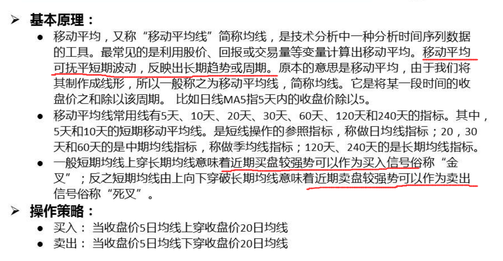
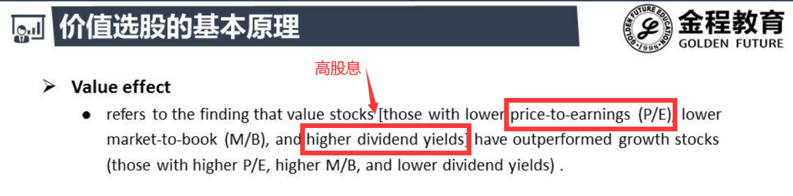
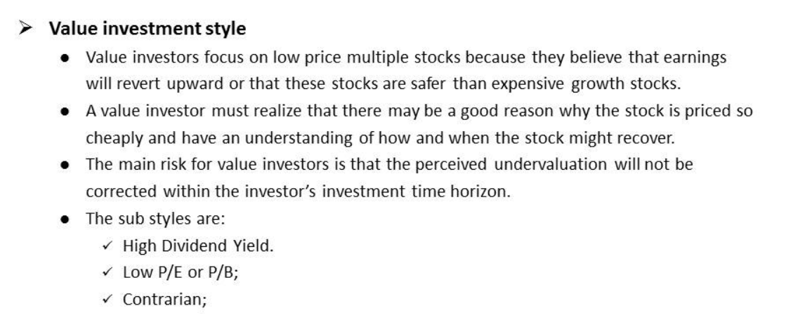
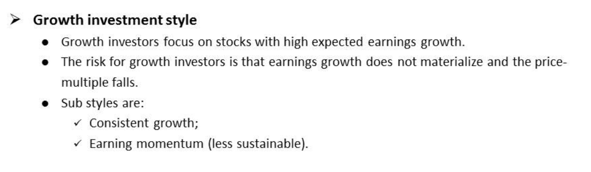
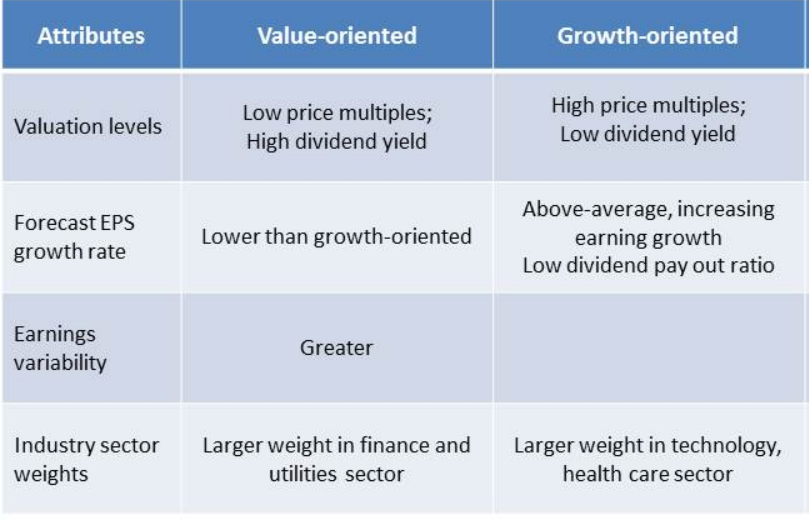

# 基本原理

- 短期 : 5日 ,10日
- 中期 : 20, 30, 60
- 长期 : 120, 240...
- 短期均线不能一直在长期之上

# 选股思路

- **价值股比增长股收益要高**  ------JF的一篇实证文章
- 增长股 : 高PE ; 价值股 : 低PE

## 价值股

- 低PE : 收益稳定 , pe过低 , 市场对它现在的看法很差, 但是未来会mean reverting
- 高股息 , 低pe ,pb 都可以作为代理变量
- 高股息意味透支了未来的增长力 , 把赚的钱都分了没有进行再投资 , 那么市场对它的估值就会变低
- 低估 : 价值 >> 价格
- 什么样的公司被低估了?
  - 发生了某些事件 , 严重打击了市场的信心 , PE减小 , 股价开始暴跌
  - 但是基本面又很好 , 现在的价格被低估了 , 未来会有报复性上涨

- 例子:
  - 重庆啤酒5亿去生产疫苗 , 失败了股价暴跌
  - pe减小 , 低估了 , 后面又涨回来了
  - 低PE 很有可能股票被低估

## 成长股

- 高PE , 1000倍的市盈率---市梦率
- 市场预期过高 ,未来会下降 , 而利润又涨不起来 ,导致股价最终下跌
- 此时对应的是低股息 , 这样钱才能去投资 , 市场对它未来看好
- 所以增长型公司往往是不发股利的

## 对比

