# 基本流程

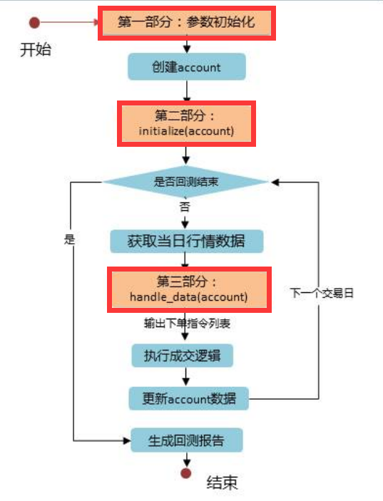

# 详细过程

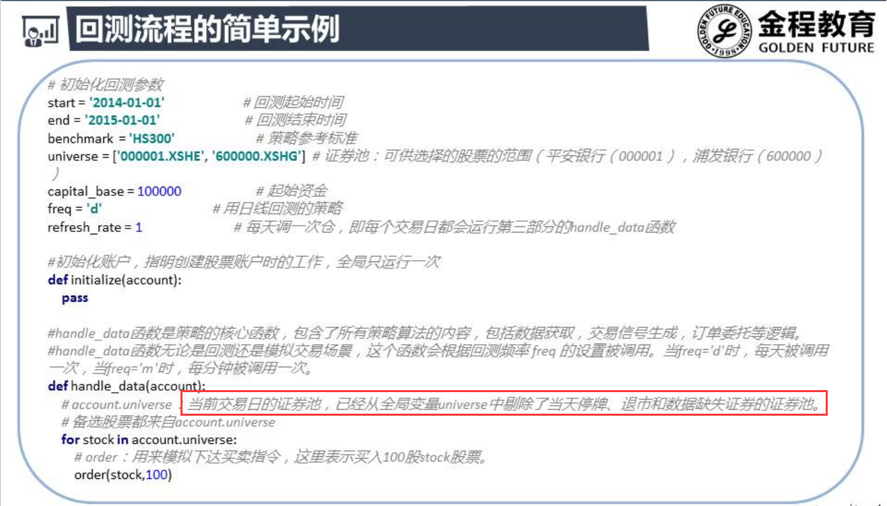

# 策略评价指标

## 评价过程

- 分析异常 , 找出原因
  - 最大值,最小值
- 找算法适用
- 要知道赚赚在哪里 ,亏亏在哪里
- 找改进方向

## 年化收益率

- **解决的是不同投资期限的策略收益比较**

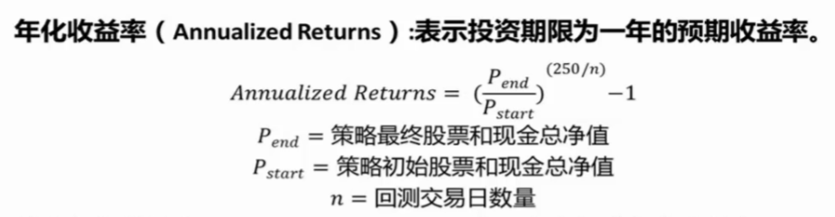

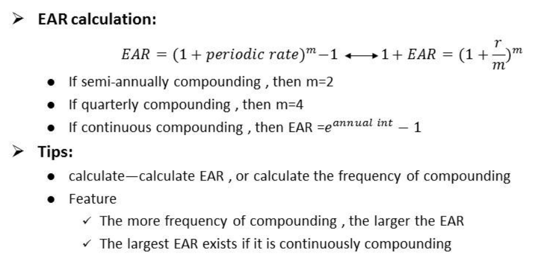

## 收益波动率

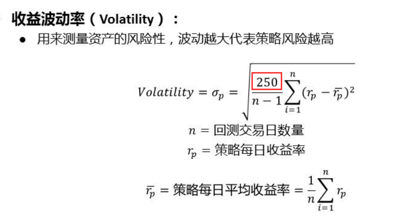

- MAD不利于求导 , 所以平方	
- 策略的收益是样本 , 证券交易所从交易第一天起到现在的收益是总体
- **为什么是n-1?**
  - n-1表示自由度 , 如果均值固定 , 那么只有n-1个值可以自由变动

## 贝塔β

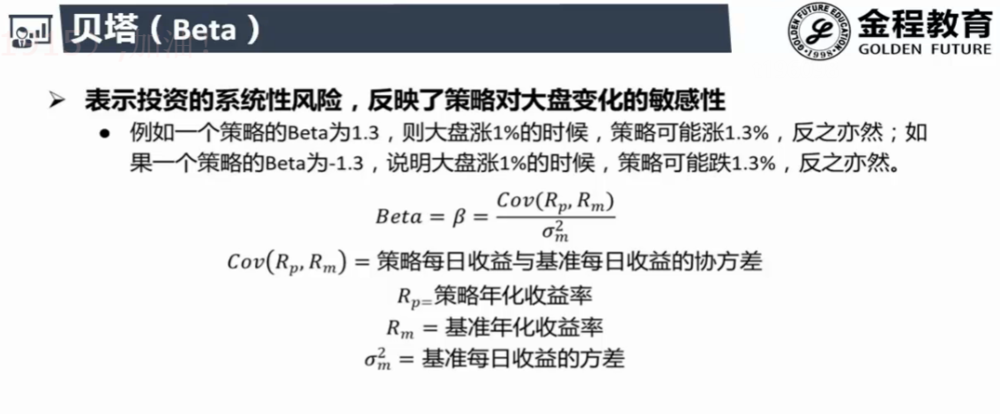

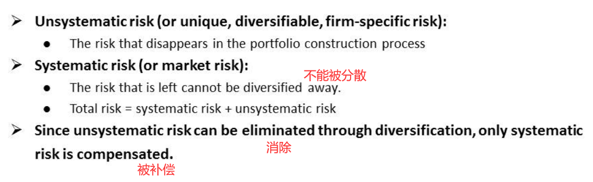

- 系统性风险 , 市场风险 : 国家,行业
- 当市场上涨 , 投资贝塔更高的组合

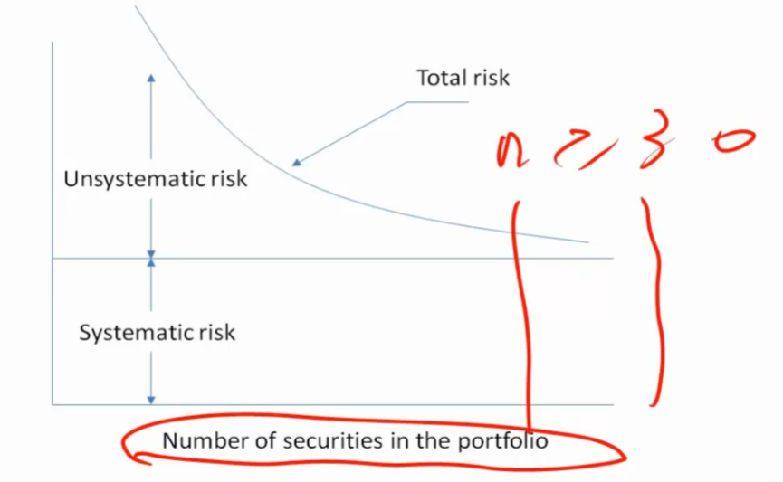

- "30" : 实证证明 ;  统计学角度 : 大于30服从正态分布

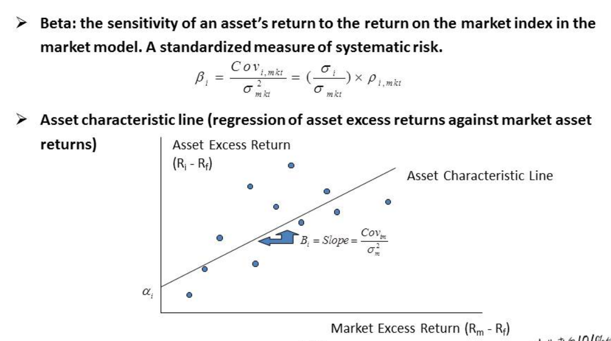

## 最大回撤

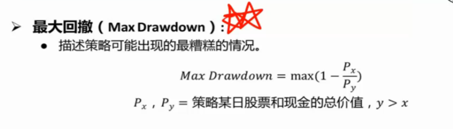

- 最大账面损失
- 买在最高, 卖在最低
- 选基金这个指标很重要

## 阿尔法α

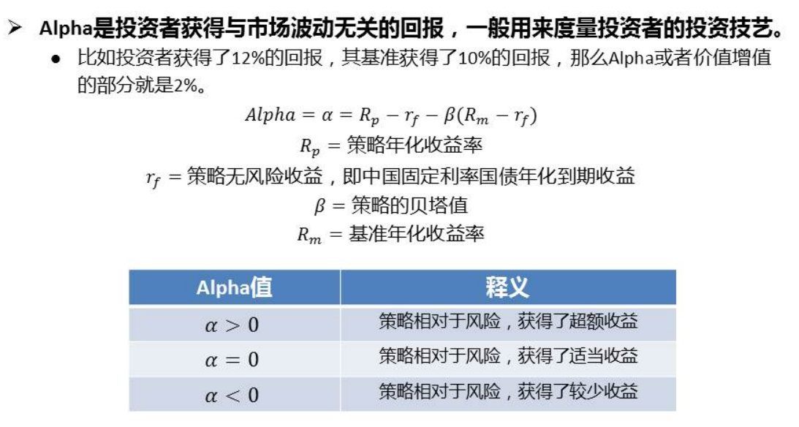

- 相对于承担的风险获得的超额的收益

## 夏普比率

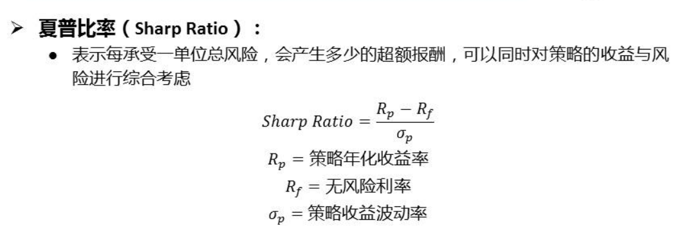

- 风险调整的收益

## 信息比率

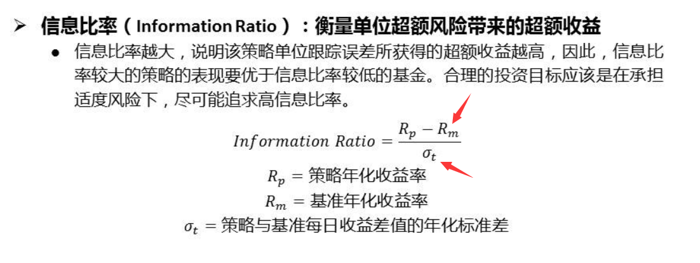