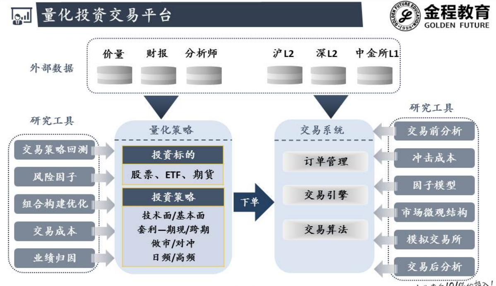
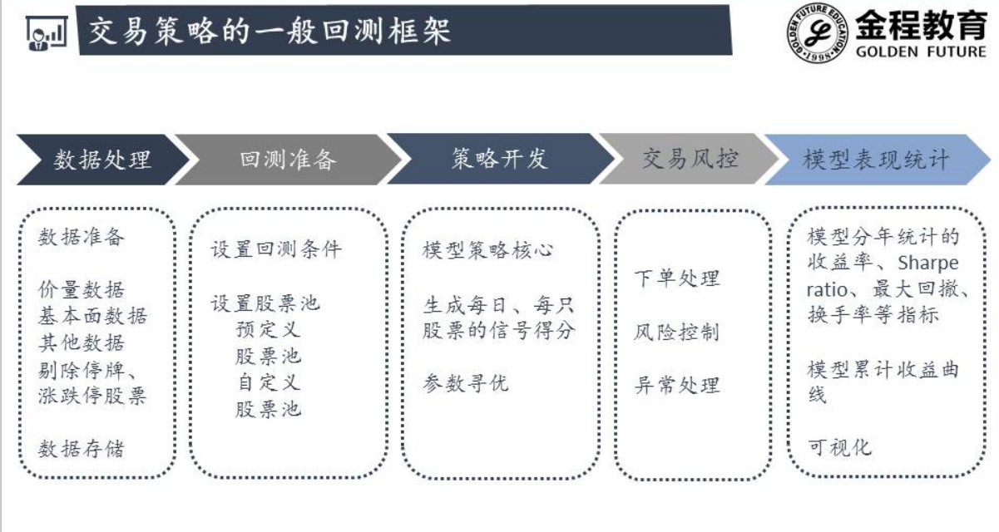
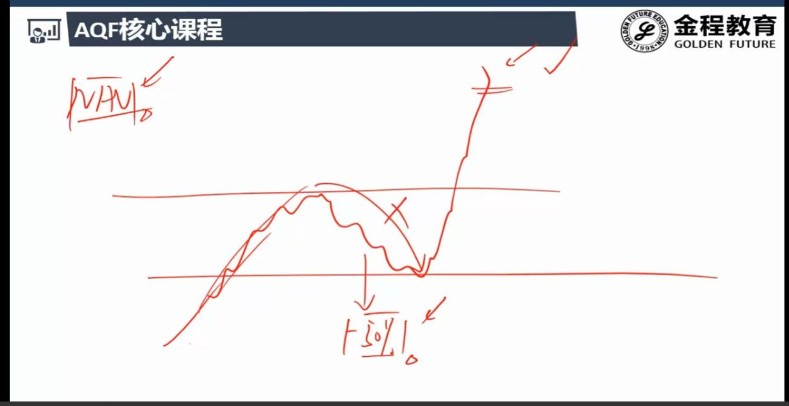

# 基础

## 1.数据处理

- 标准化 : (-∞,+∞)  ---> [-1,1]
- 空值处理
- 数据对齐 , 资产负债表日
- 时区处理

## 2.交易平台

### 2.1数据(最重要)

- 质量第一 : GIGO
- 高频交易:
  - CTA 期货
  - 分钟数据 , tick数据
  - 数据要求很高 
  - 一天的数据量就可达几千上万条
- 免费数据有局限性
- 万德 (最好最贵)  东方财富  同花顺

### 2.2数据分类

#### 2.2.1价量数据

- 在CTA里面特别重要
- 主要是技术分析 , 用基本面很少

#### 2.2.2基本面数据

- 股票
- 财报数据

#### 2.2.3分析师数据

- 非常好用的因子
- 券商的研究团队的研究报告
- 大多数分析师都认可的股票

#### 2.2.4交易所的数据

## 3.研究工具

- 组合构建优化: 马科维兹 , 有效边界
- 冲击成本 : 股票价格会受到你下大单的影响 , 继续购买成本上涨 ; 反之亦然
- 滑点 : 回测时的交易时下单价和实际成交价的差异
  - 股票流动性低 , 成交量小的时候 差异越明显

## 4.策略逻辑

## 5.交易系统

- 订单管理 : 买卖什么  买卖多少
- 交易引擎 :真正把订单下到交易所
- 交易算法 : 
  - VWAP : 订单拆细 , 降低冲击成本
  - TWAP

## 6.回测框架

分析师 , 有个想法 , 不知道能不能赚钱 ,把想法写成模型 

用历史数据跑一下 , 看看在过去用这个策略能不能赚钱

举个例子 : 多因子 PE 单因子模型

### 6.1数据处理

### 6.2回测准备

- 上证50
- 中证500
- 沪深300

### 6.3策略开发

- 信号得分:  多种信号的综合得分 
  - 1 :long
  - 0 : hold
  - -1 :short

### 6.4交易风控

- 实盘之后

### 6.5模型表现统计

- sharpe : 风险调整之后的收益  每承担一单位风险的收益
- 0.5 的sharpe 比较粗糙
- 2 就很好 , 一个单位风险可以带来2 个单位收益

- 最大回撤:

  

- 回撤太大 基金客户都赎回了 ,都没有机会撑到最后上涨