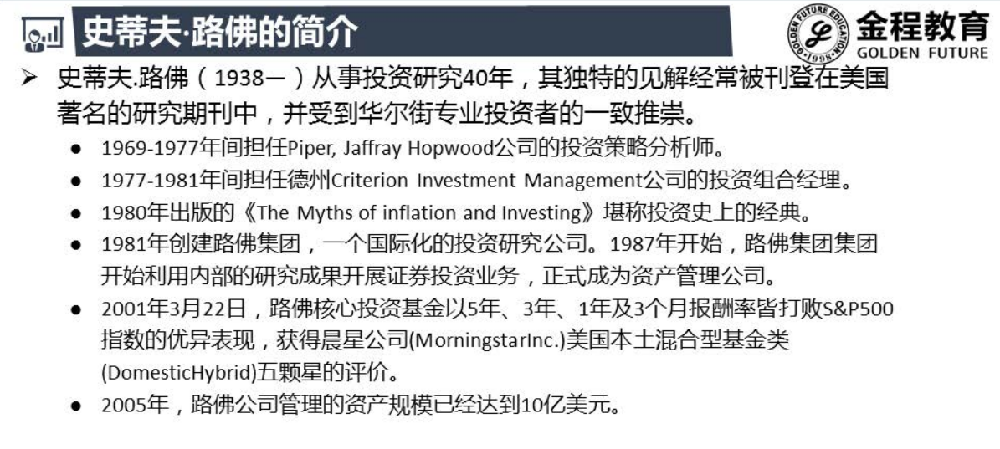
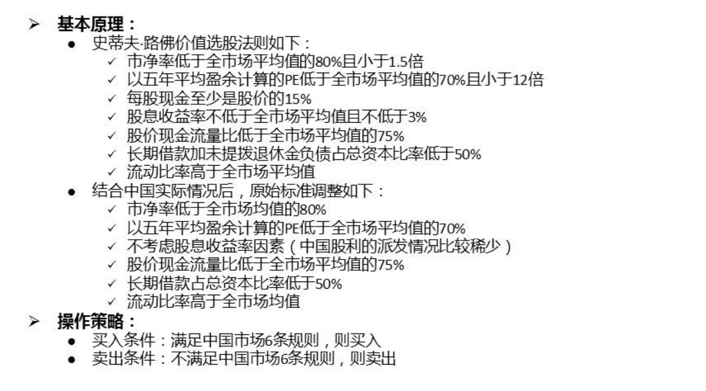
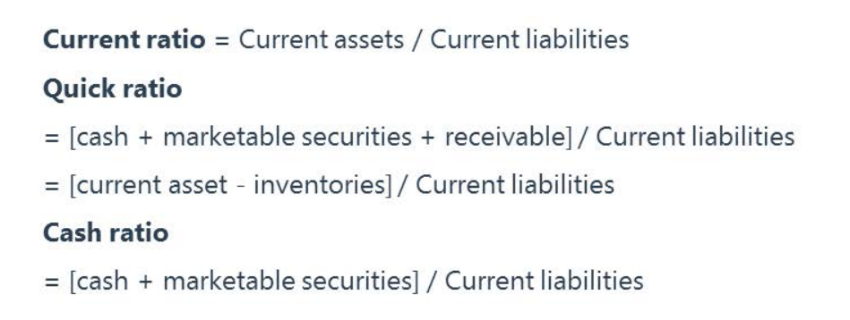
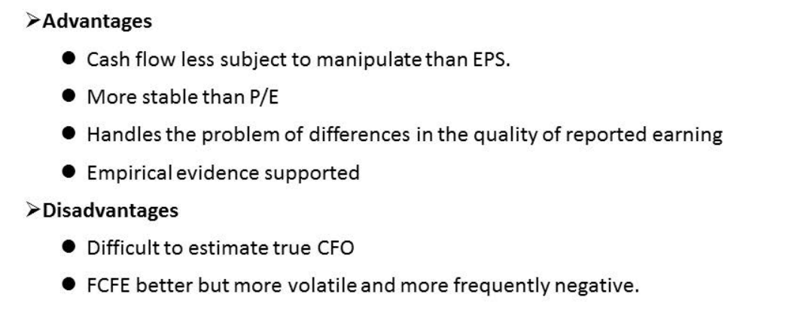
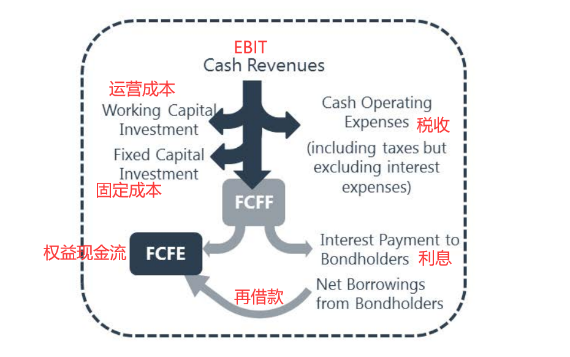

# 史蒂夫路佛简介

# 原理

## 流动比率

- 一个好公司不一定是好股票, 一个好股票是一个好公司
- 流动比率 = 短期变现资产/短期偿还负债

## 速动比率

- 速动比率 = ( 现金 + 市场可出售的证券 + 应收账款 ) / 流动负债

  ​				 = (流动资产 - 存货) / 流动负债

- 速动比率减掉了不易变现的存货 , 表明偿债能力更强

## 现金比率

- 衡量的流动性更强
- 反应流动性(短期偿债能力) : 现金比率 > 速动比率 > 流动比率

## 股价现金流量比

- 现金为王 , 很难被操纵 , 审计会查银行函证
- 难以估计真正的可持续的经营性现金流
- CFO是衡量总资产的 , 不适用. FCFE才是衡量所有者权益的

 