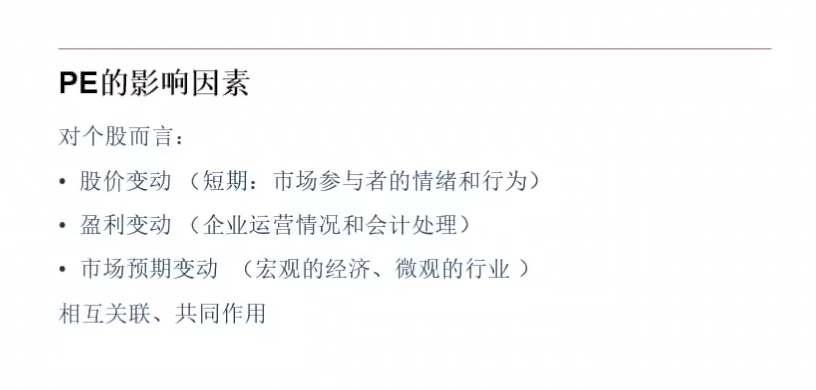
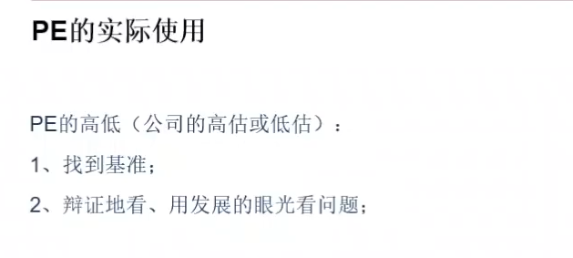
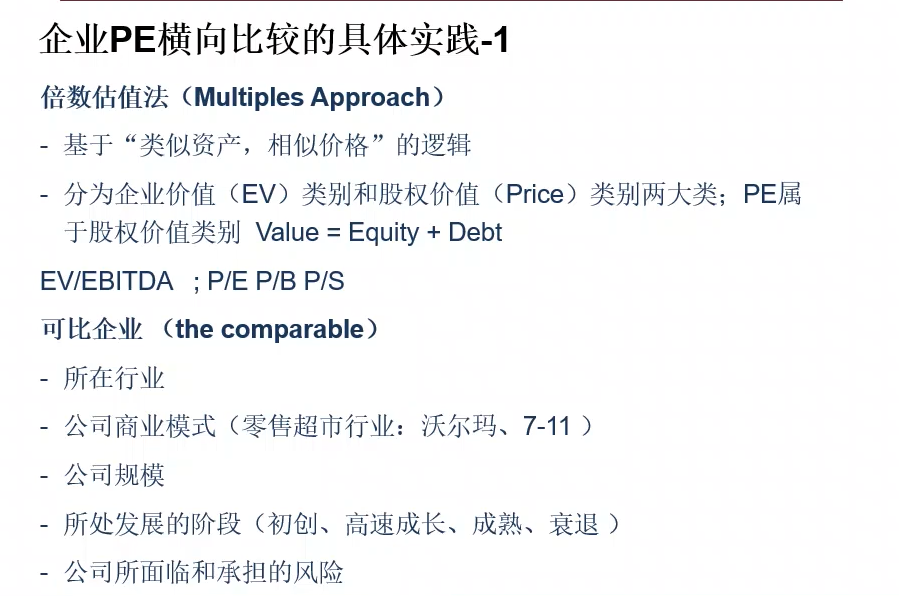
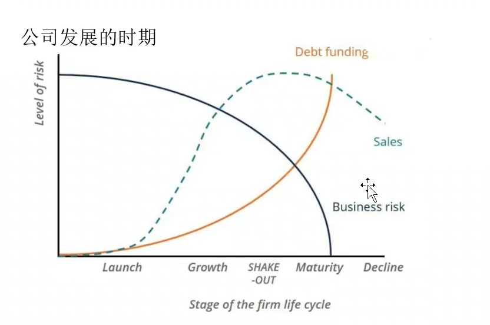
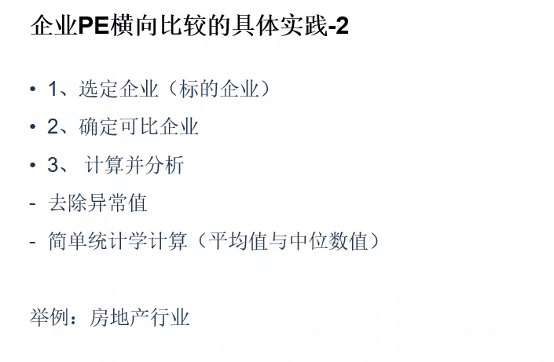
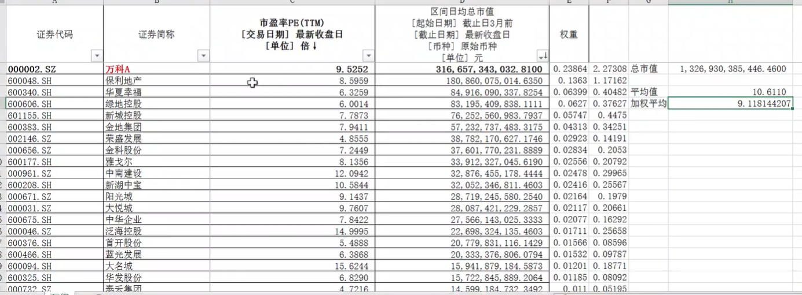

这是一个估值指标

这是一个"比较" 指标   横向|纵向

这是一个A股市场机构投资者认可的指标

**PE是一个动态的数值: 价格每个交易日都变化**

**PE是一个滞后的数值: 不能够更新公司每一天的盈利**

- 某行业PE:20-30倍 , 行业某个股突然一波上涨行情 PE 来到了80倍
- PE的变化到底是因为基本面发生了变化所以市场给它一个很高的估值,还是因为股价的正常或者不正常的波动行为所导致的
- 市场预期变动一般来说不是影响某个个股,而是对整个市场或者行业
  - 受政策性影响比较大的行业: 房地产行业

- 它是一个比较指标
- 这个基准很多时候就是行业的平均水平,或者是行业具有典型代表的龙头企业
- 对未来的预测
  - 行业30-40倍 , 某个股票60倍,现在的眼光来看是被高估的
  - 发展的眼光来看, 预测未来盈利会翻一番
  - 那么未来的市盈率是30倍, 相对于行业其实是低估的

## 横向比较

