# 本杰明格雷厄姆简介

- 巴菲特的研究生导师

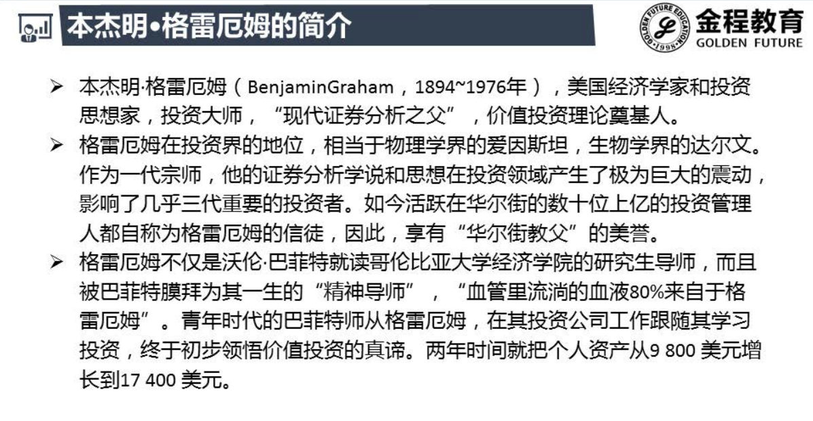

# 成长股投资法

## 原理

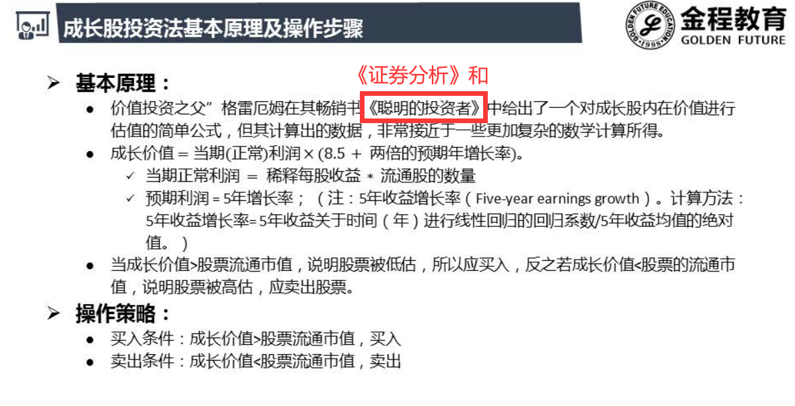

- 价格围绕价值波动

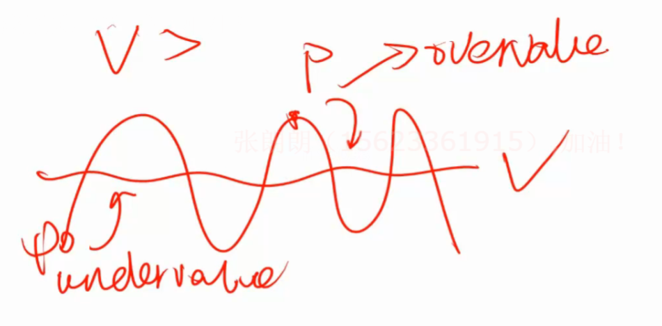

## 稀释每股收益

### 基础每股收益

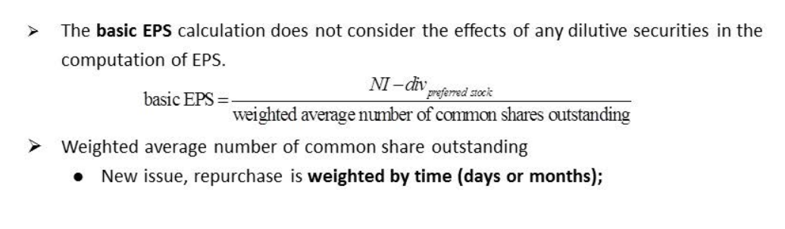

- 普通股每股收益 , 净利润先扣除给优先股分的钱
- 后面才持有的股数不能分享全年的利润, 所以要和持股时间进行加权

#### 实例

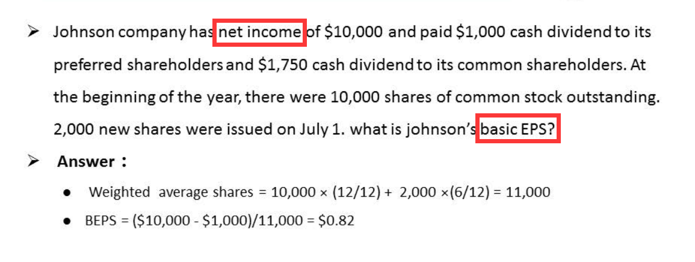

### 稀释每股收益

- 与基础每股收益相比较小者

- 把不是普通股的证券转换成普通股 
- 分子 : 净利润 + 不用支付的优先股股息或债券利息
- 分母 : 原普通股股数 + 转的股数

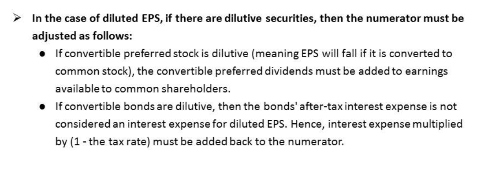

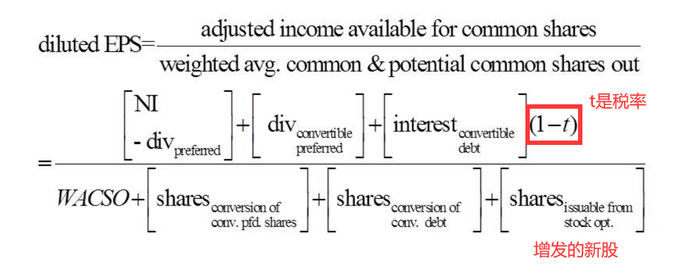

#### 实例

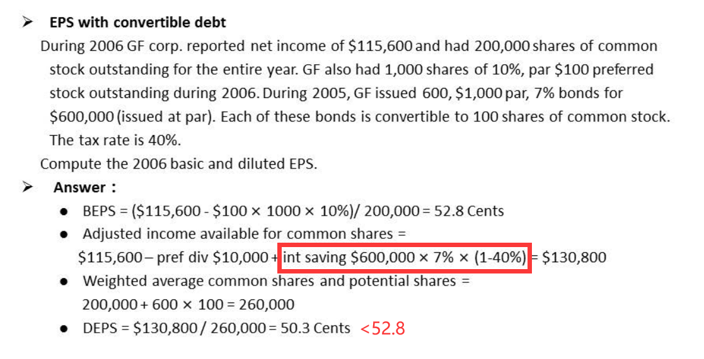

# 积极投资法

## 原理

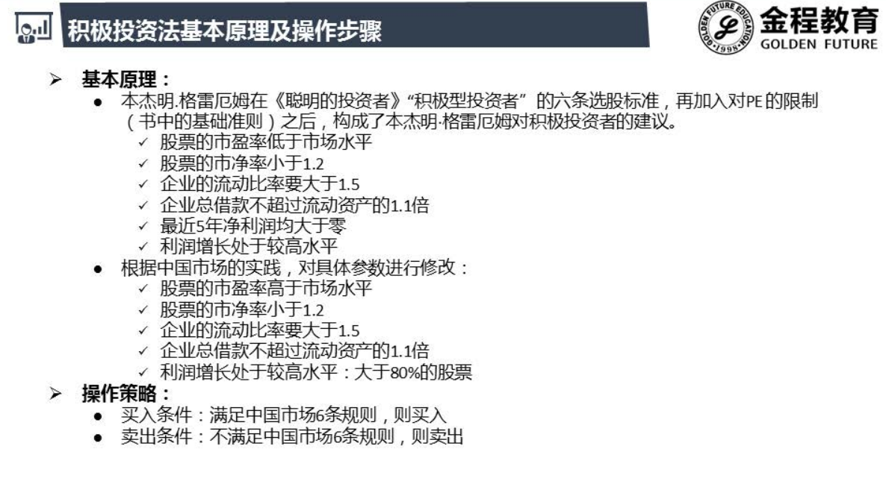

## 市盈率(EPS调整)

P(市价)/E(每股盈利)

### 计算

每股收益的计算有两种方法:

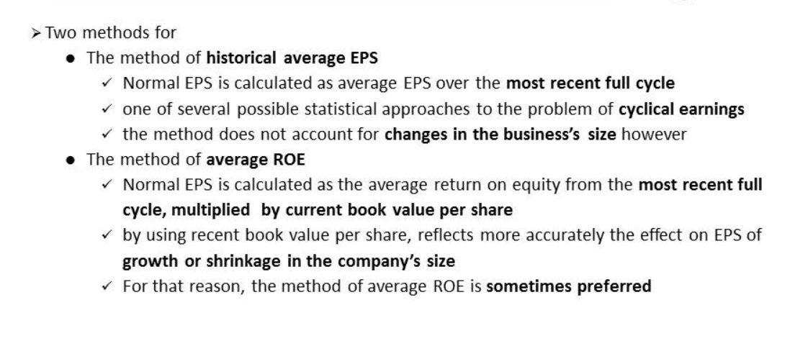

方法一:

- 每股收益来自于每一季度的财报
- 一年四季财报 , 9月用6月的eps , 3月用12月的eps
- 为了让eps更准确取最近一个整周期的平均值
- 这个方法没有考虑股价波动的情况导致不准确

方法二:

- 取权益收益率(ROE)的平均值再乘以当期的股价作为当期的每股收益

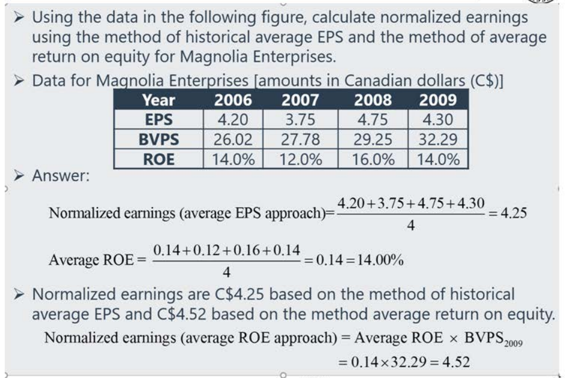

### 优缺点

## 市净率

P/每股账面价值

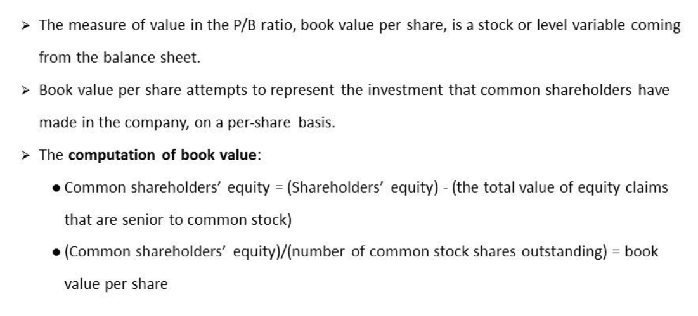

### 优缺点

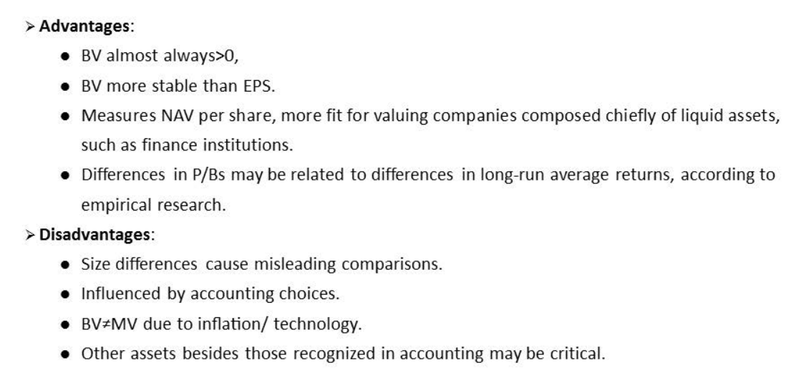

- 银行PB低, 教育PB高 , 没有可比性 , 只能同行业比较

