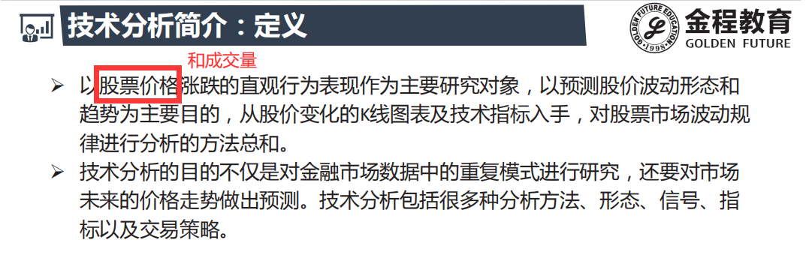
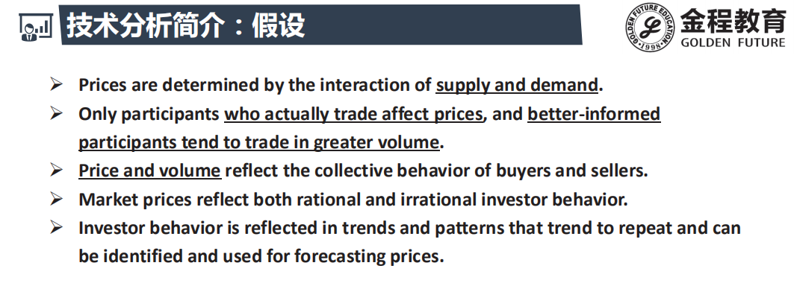
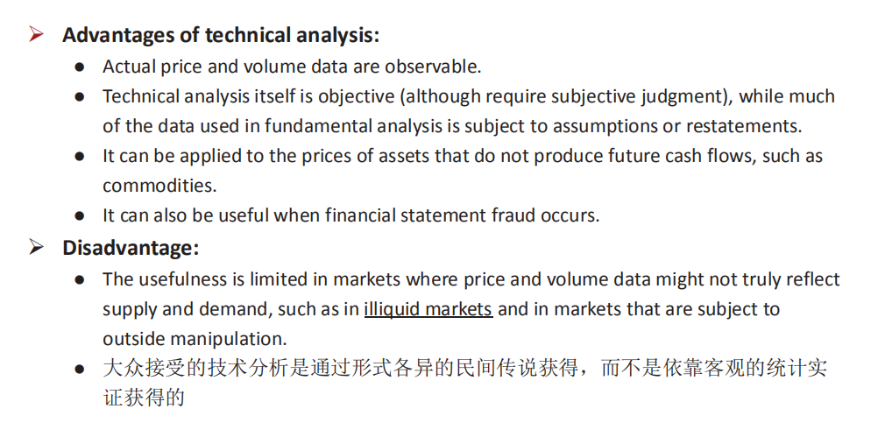
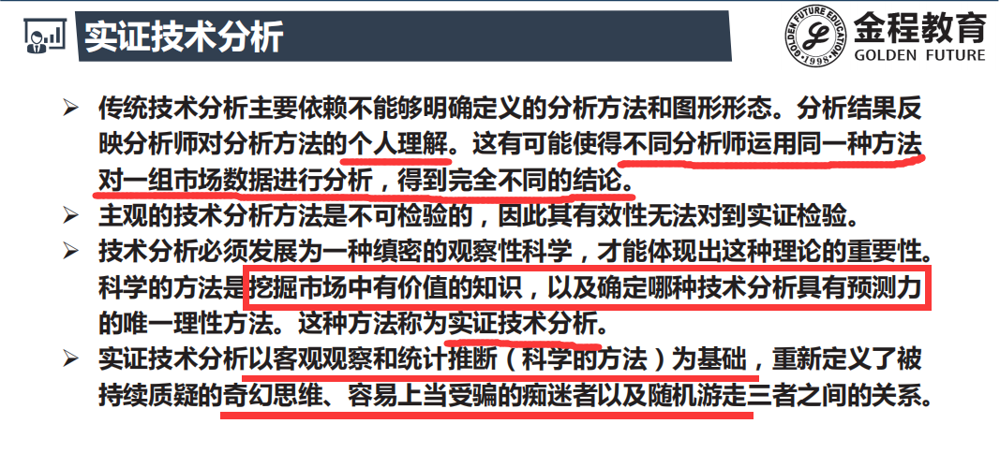
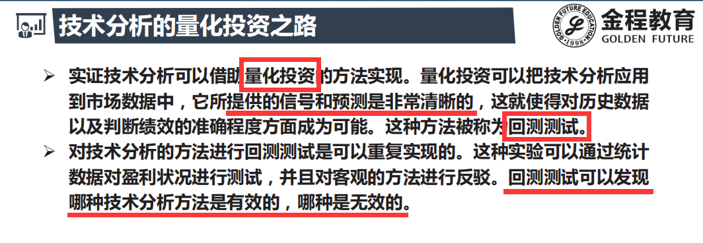
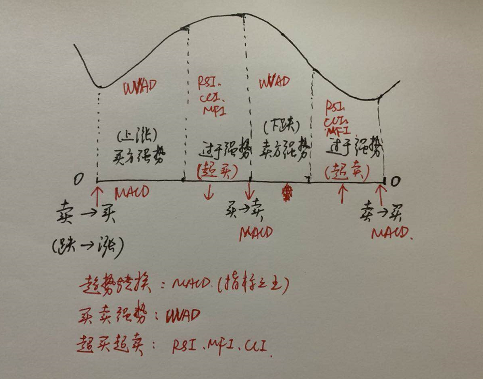

# 简介

- 三重顶 ,三重底出现的频率较高
- 研究出现之后股票的走势规律
- 技术分析重要步骤:
  - 1.预测
  - 2.仓位控制(你的预测只是概率性的)
  - 3.情绪管理

# 假设

- 价格由供求决定
- 有更多信息的人会有更多的成交量
- 市场价格同时反映理性(机构) 和非理性(散户)的行为
-  **投资者的行为反映在趋势和模式中，这些趋势和模式将被重复，并可被识别和用于预测价格.**

# 优势劣势

**优势:**

- 技术分析本身是客观的（虽然需要主观判断），而基本面分析中使用的大部分数据都受到假设或重述的影响。
  - 比如如果要把未来现金流折现 , 要借助财务报表数据
  - 而财务报表数据基于会计上的假设
- 期货基本上都是技术分析, 因为大宗商品没有基本面数据
- 财务报表造假情况 , 导致估值不准确
  - 公司的审计(CPA)是由公司管理层聘请的 , 所以存在一定的利益冲突
  - 所做的结论往往不那么客观

# 实证技术分析

# 小周期循环

- **技术指标就是用来找到股价现在所处的位置**

