# K线介绍

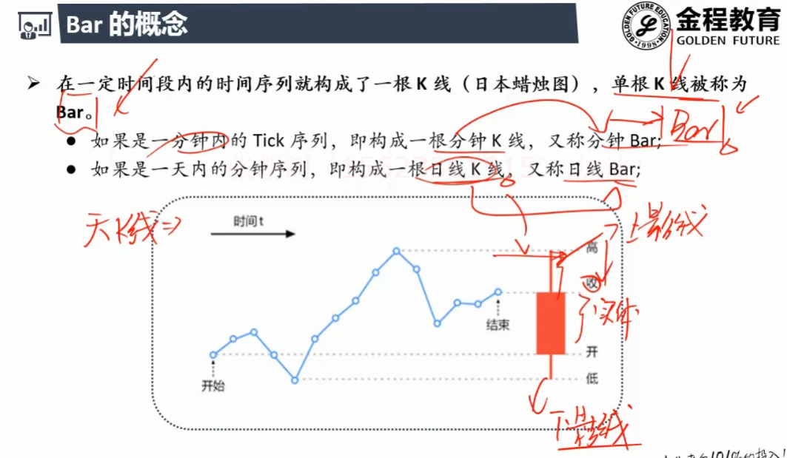

## 频率

### 天

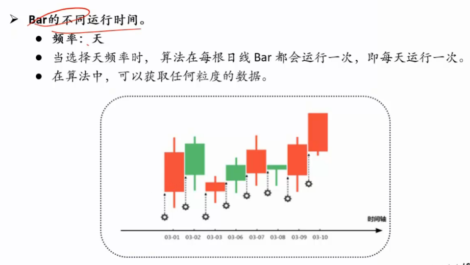

### 分钟

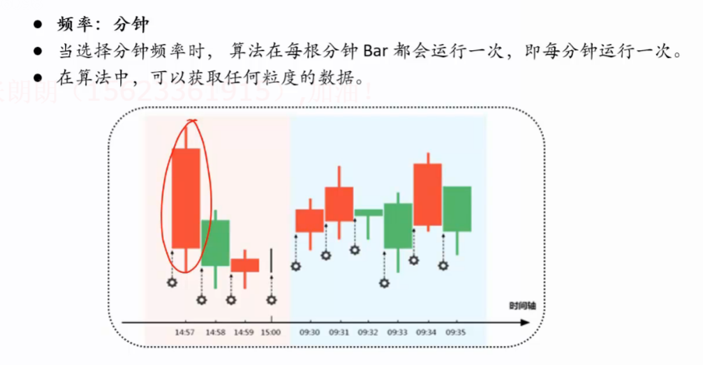

### Tick

- **最小单位**

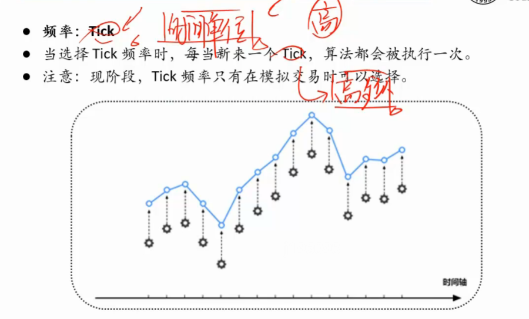

# EMA指标

## MA指标

- **MA有滞后效应**
- 之前每天的价格是等权重的
- 金叉点股票已经涨了很多才产生的金叉
- 很可能买在高点 , 即将回调

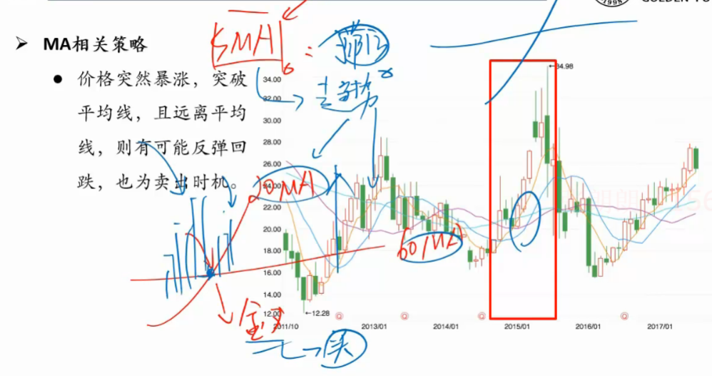

++++++

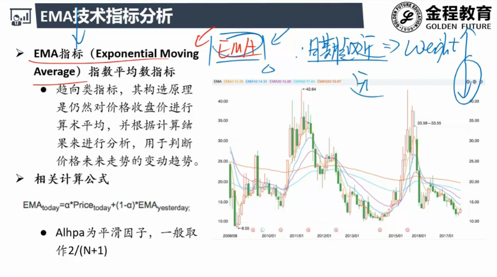

- 反应速度比SMA快
- **信号不稳定,一会金叉一会死叉**
- SMA更稳定

# 

# KDJ指标

- 短期指标 , 抓不住大趋势 , 适合震荡市
- 频繁发出交易信号

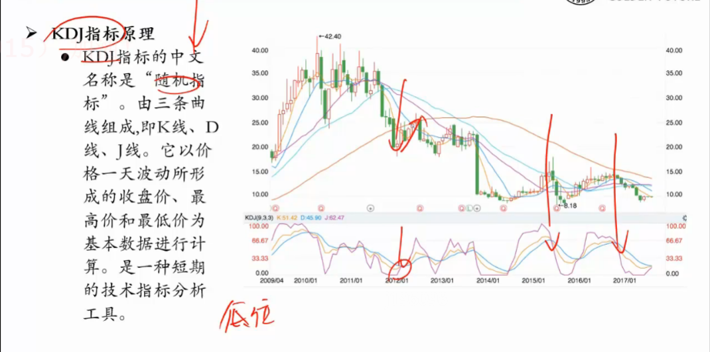

## 计算方法

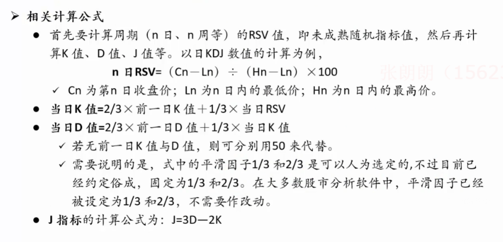

## 各线含义

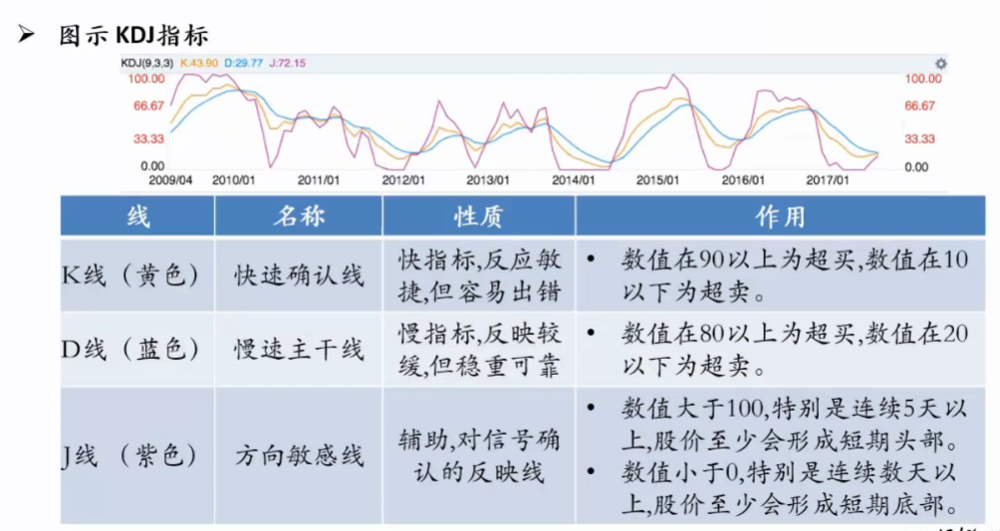

## 使用

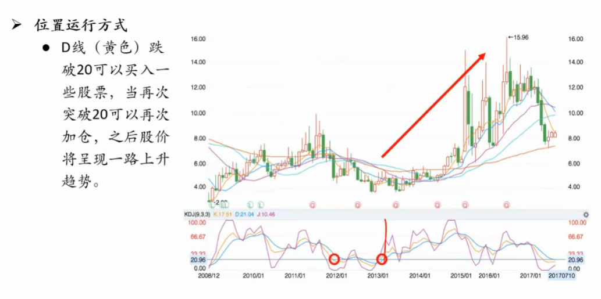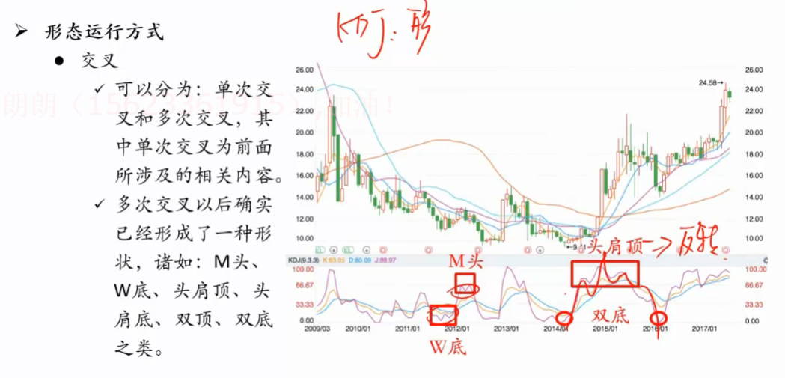

### W底

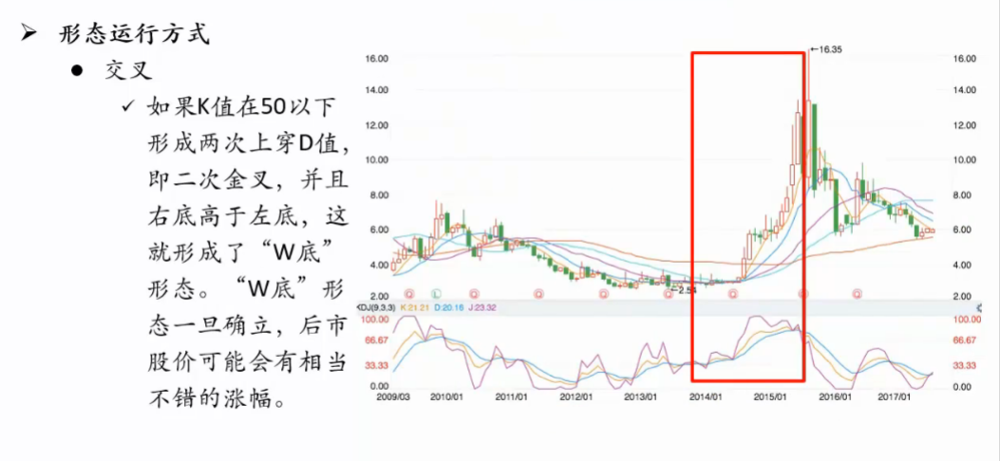

### M头

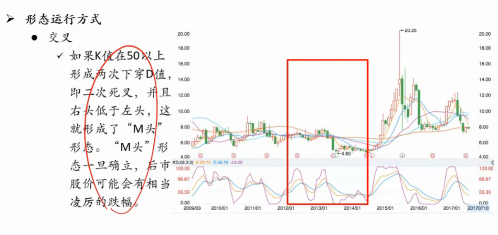

