# RSI指标

**判断多空力量强弱**

**判断超买超卖趋势**
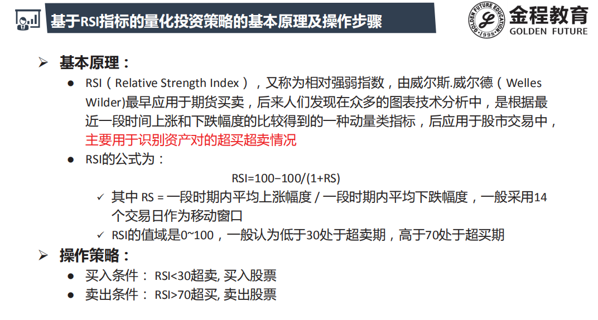

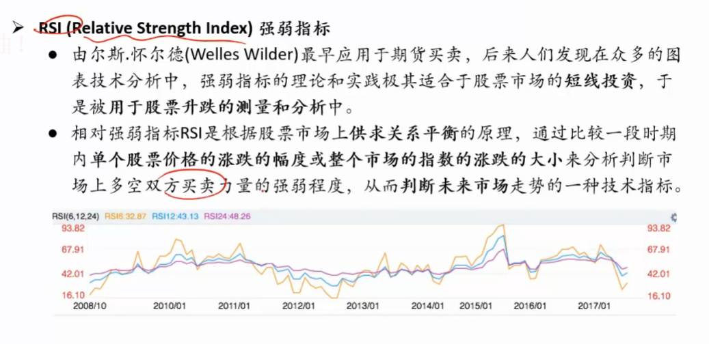

## 计算方法

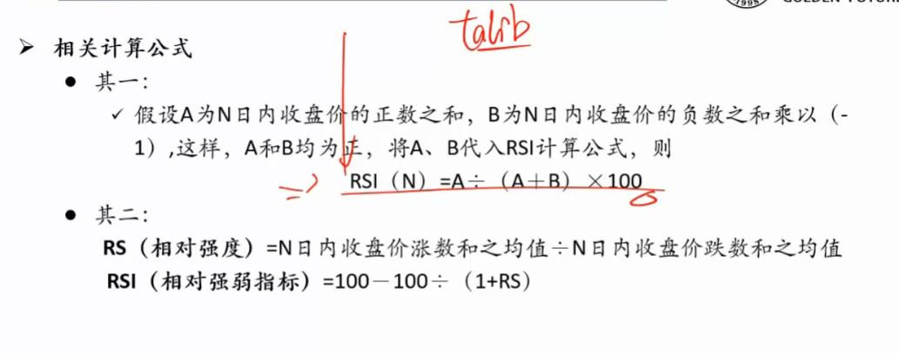

## 使用

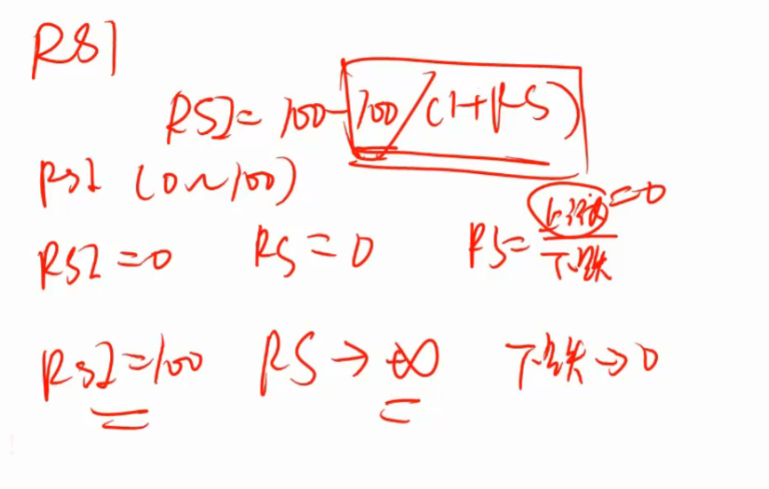

### 超买

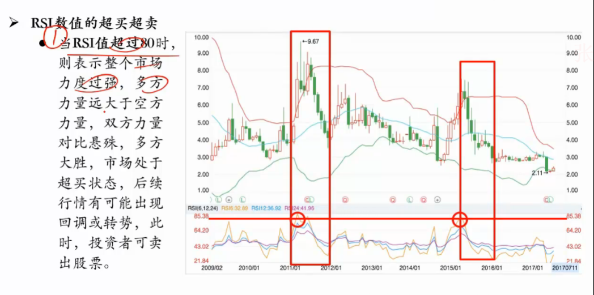

### 超卖

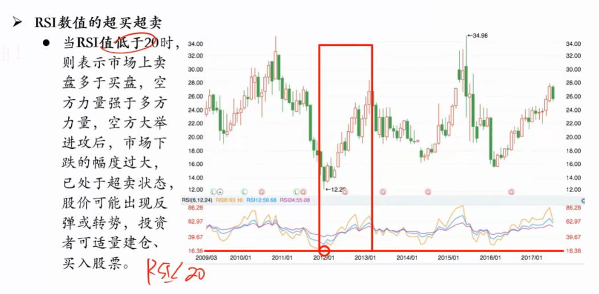

# MFI指标

## 计算方法

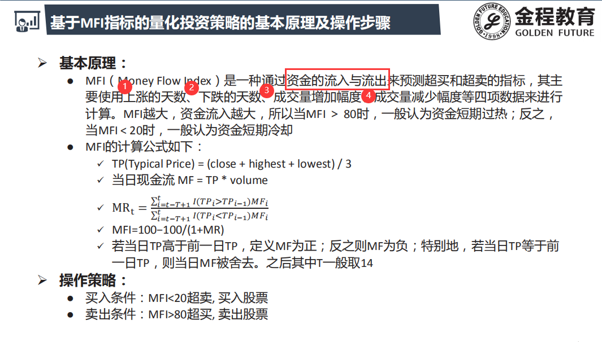

- 资金流  = 价格 * 成交量
- 与RSI比较像, 也是上涨比上下跌
- 但是MFI 考虑了成交量加权 , 用上涨资金流/下跌资金流
- TP是近似值 , 准确性较差

# CCI指标

**统计学分布测量股价的偏离程度**

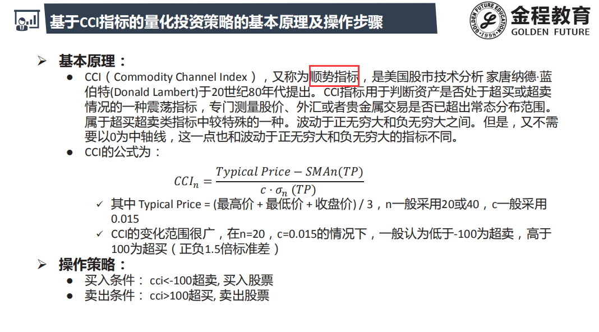

- C = 0.015 表示1.5倍标准差
- C 越大表示越谨慎 

## 计算方法

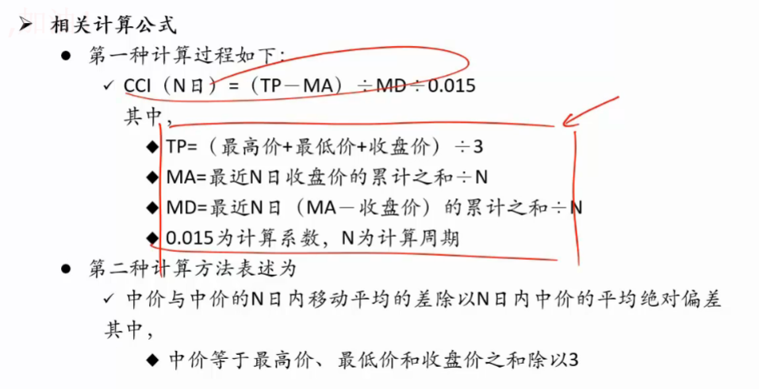

## 使用

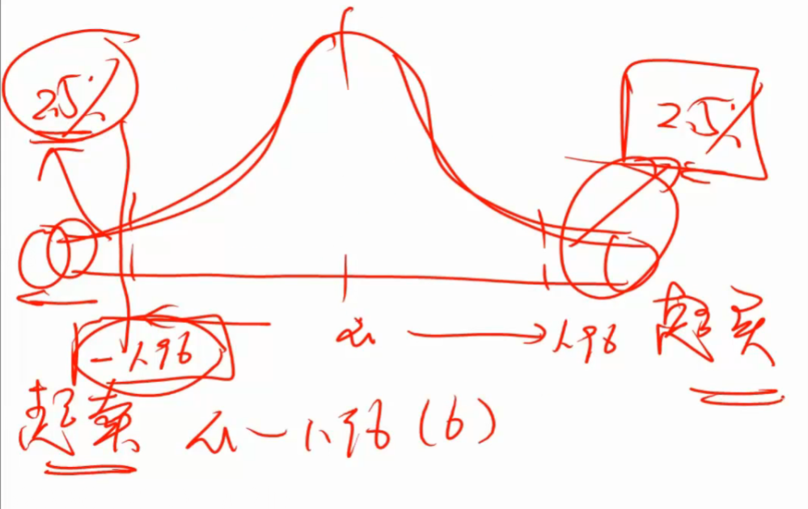

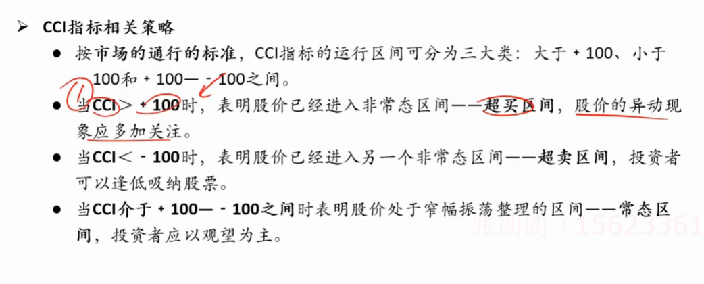

- 可当过滤器使用

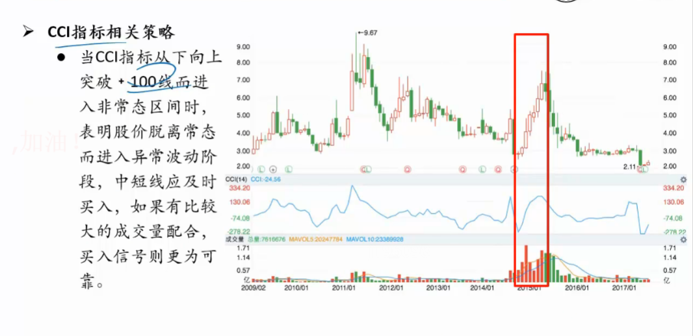