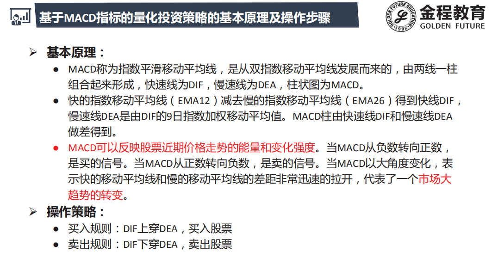
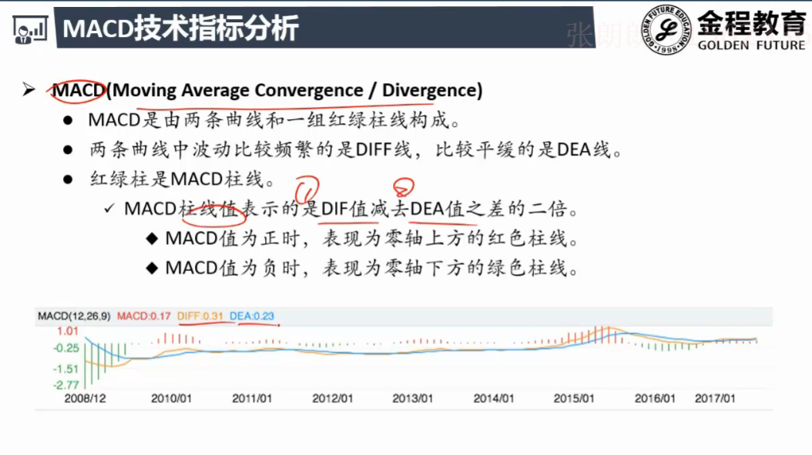
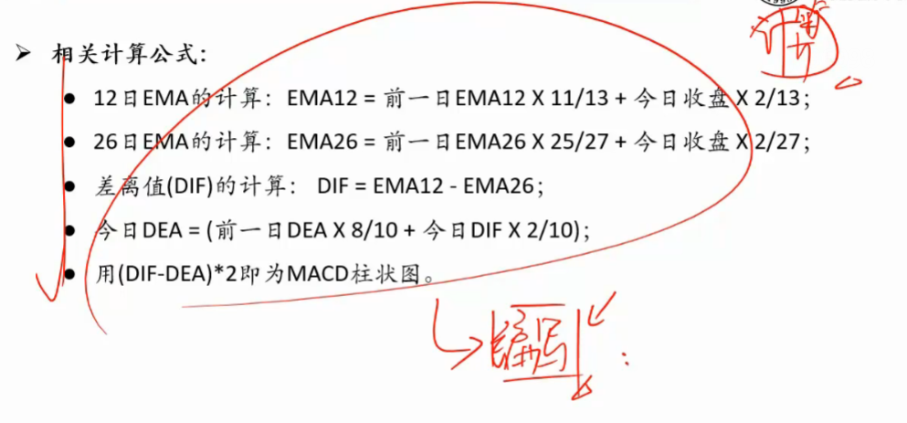
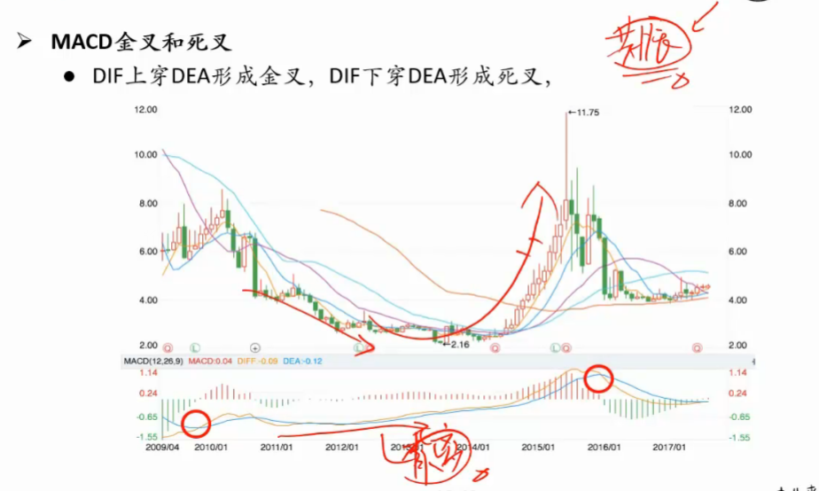
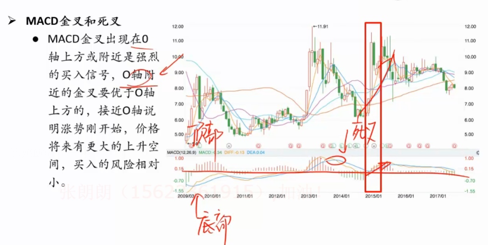
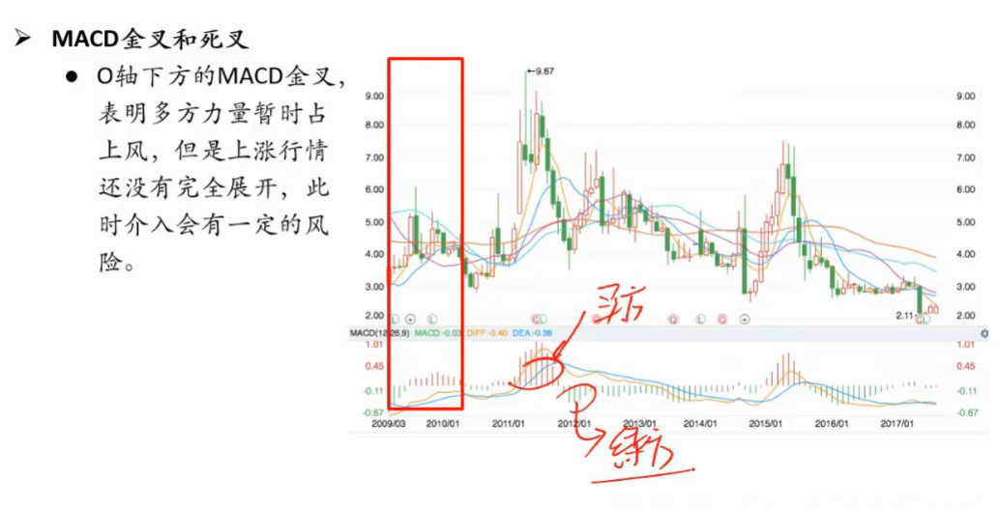
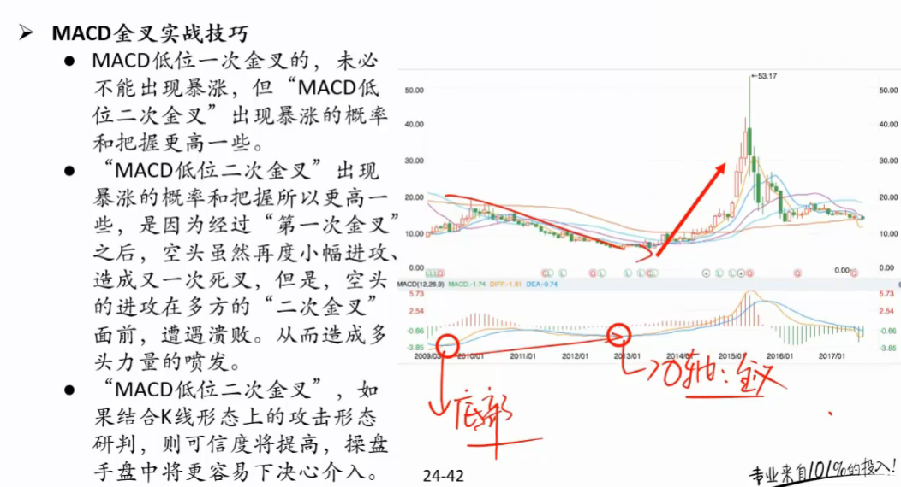

# MACD

- **DIFF : Difference**
  
  - 短期与长期的差值
  - DIF >0 短期均线大于长期均线	上涨趋势 , 差值越大 , 表示加速上涨
  - DIF <0 短期均线小于长期均线    下跌趋势 , 负差值越大 , 表示加速下跌
- **DEA : Difference Exponential Average**

  - DIFF (短期与长期差值)的9日指数移动平均
  - 去掉噪声
- **MACD =2*[ EMA1(DIF) - EMA9(DIF)]**

  - 也是短期均线减长期均线 
  - MACD<0 ----> MACD>0 : 金叉

    - 卖方强势转换为买方强势
    - 表明差值DIFF在变大

## 使用

- 发生背离

###   0轴附近的金叉

- **顶部死叉,底部金叉更加有效**

- 红柱大, 买方力量强; 绿柱大,卖方力量强

### 低位二次金叉

  