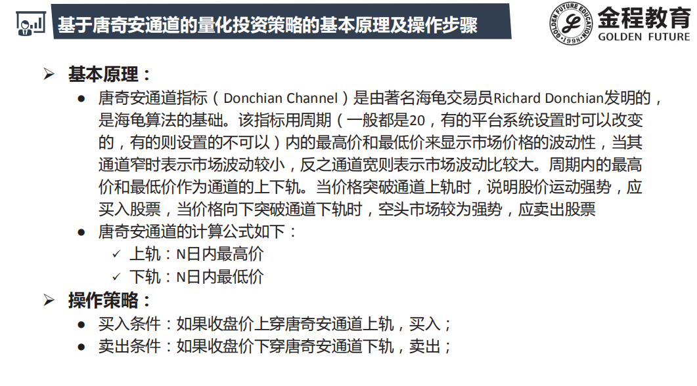
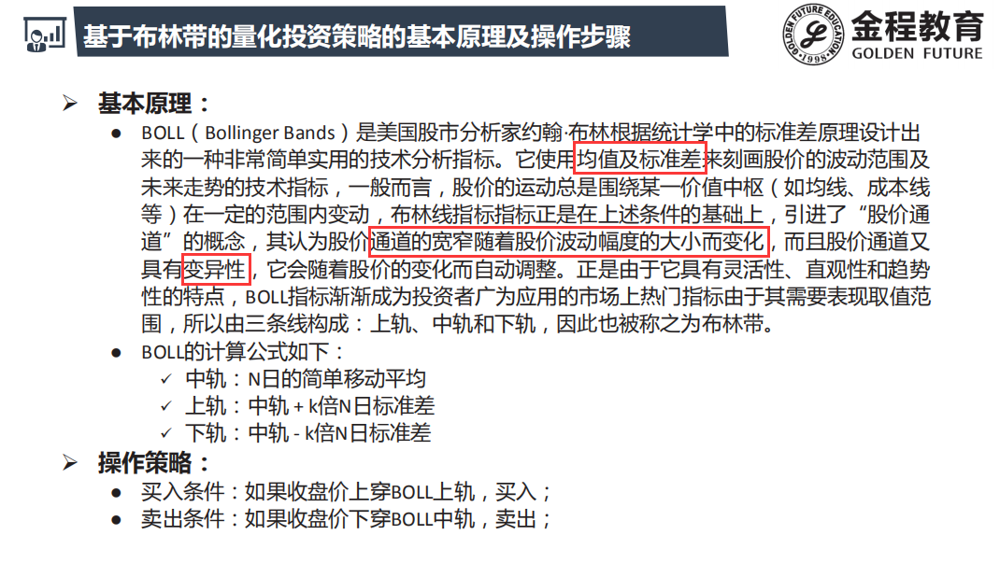
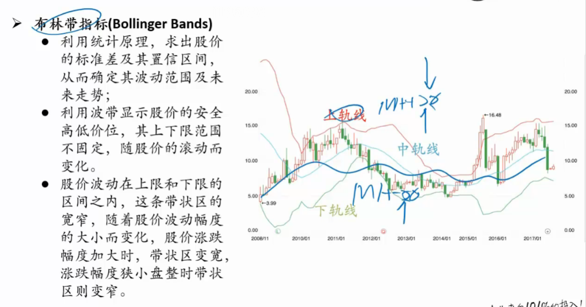
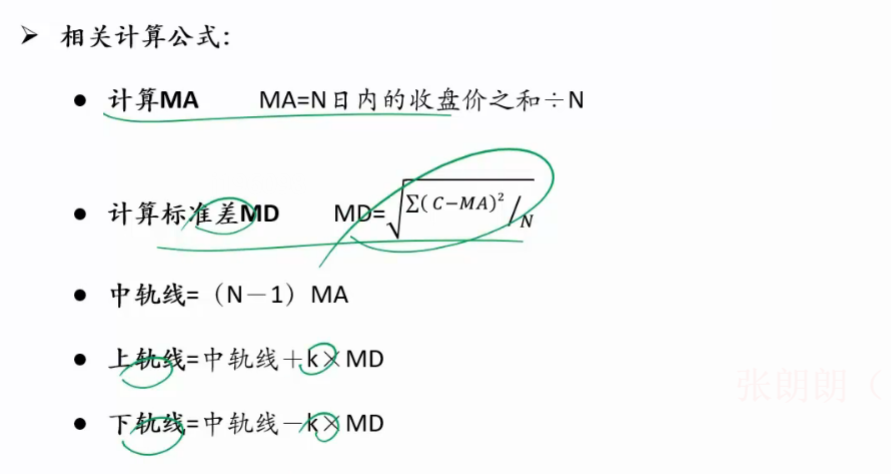
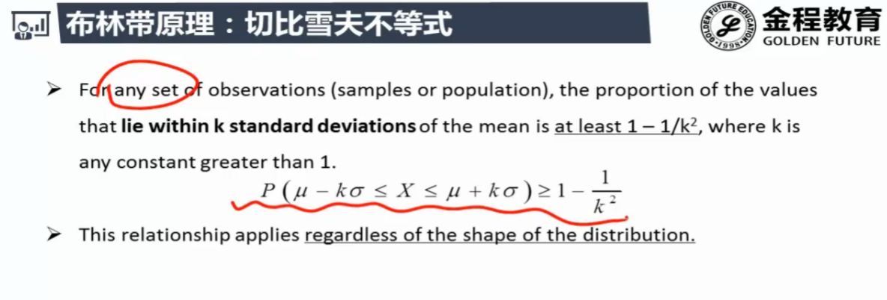
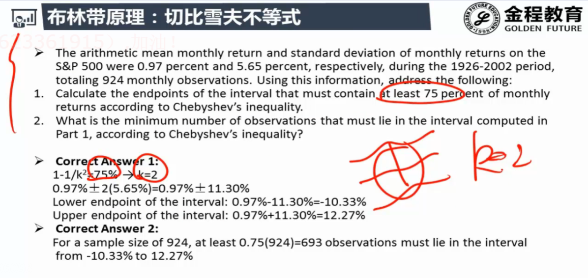

# 通道技术

- 均值回归 : 压力线 , 支撑线 , 可以看作是一种超买超卖指标
- 突破上下轨 : 进入大周期

## 唐奇安通道

- 突破上轨没有卖盘的抛压 , 庄家拉升股价没有很多的卖盘出现
- 突破下轨没有庄家接盘 , 一路下跌
- 散户是不能影响市场的 , 要跟着庄家做 , 要判断大势

## 布林带通道

- 该指标和CCI一样,突破信号既可做动量也可做反转
- 看两根k线是突破还是回调
- 可结合大市判断 : 牛熊震荡

### 计算公式

### 切比雪夫不等式

- 不论股价服从什么分布

- 可以确定股价在通道里面的概率

