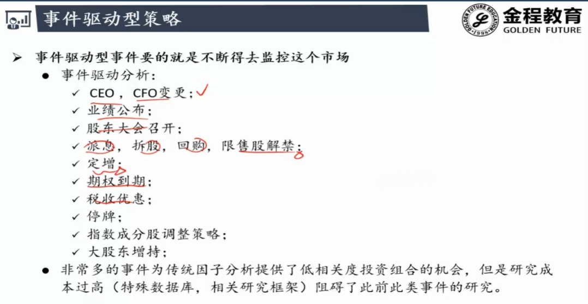
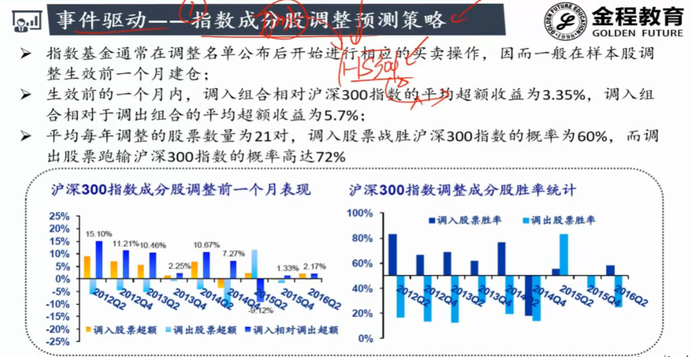
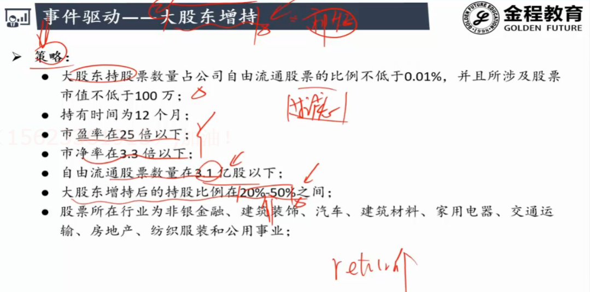
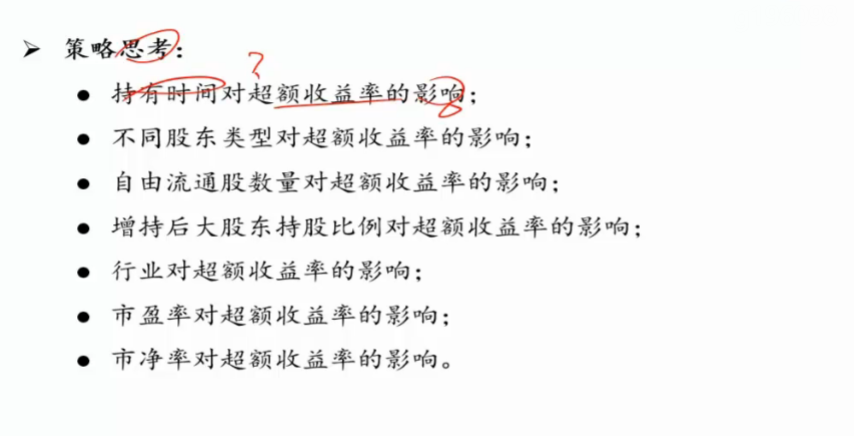
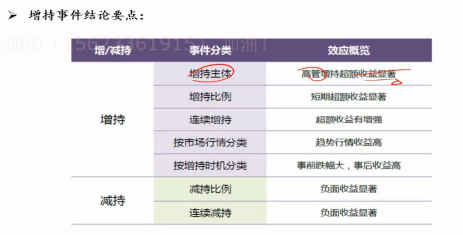

# 事件驱动型策略

- 定增用的很多

- 成本较高
- 实时监控市场 :  3s , 5s , 1 min ...

### 实例1

- hs300每年年底对成份股进行调整
- 12月份调整 ,11月份进行预测会加入或调出
- 加入 : 买指数的公司会买这支
- 调出 : 原持有的会卖出

### 案例2

- 大股东看好未来股票发展
- 认为当前价格被低估了

- 政府背景大股东增持 : 国家意志体现

  