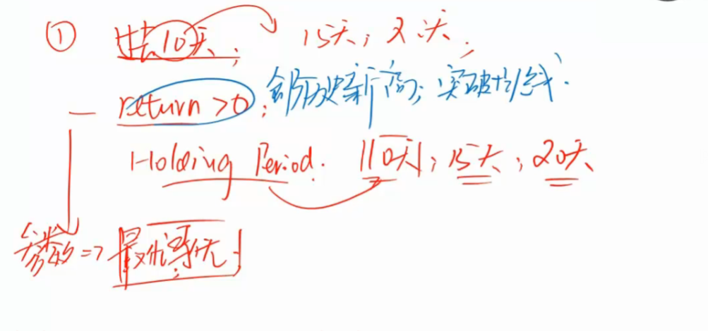
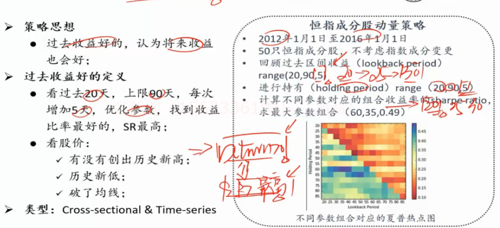
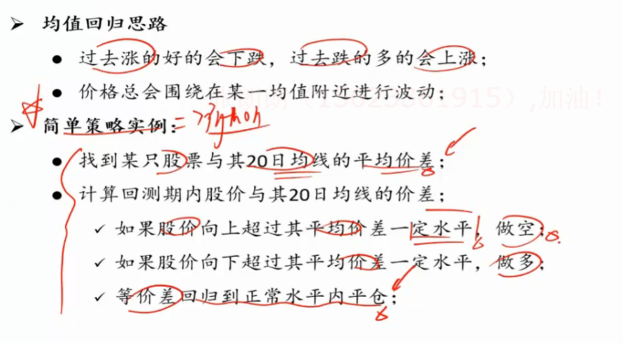
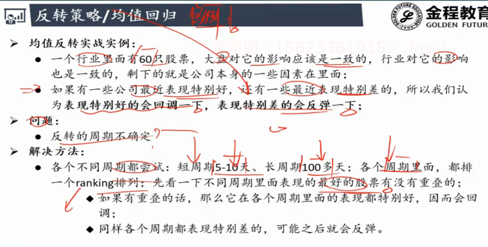
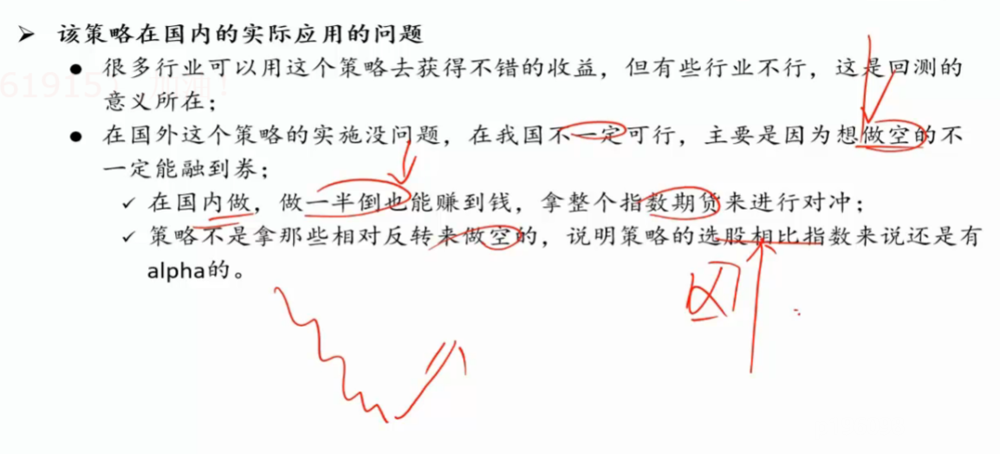

# 动量与反转

## 动量策略

过去涨的好的现在也会涨 . 强者恒强

- 如何量化动量?
- 过去是几天?
- 将来要持有几天?
- 什么算是涨得好?
  - return>0
  - 历史新高/低
  - 均线

**参数寻优:**

- 交给python
- 变换不同的参数 
- 找出return最大 或者夏普比率最高的那一组

## 反转策略/均值回归

- 怎么知道判断它要回归而不是继续上涨?
  - 股价和均线之间的价差过大

**案例:**

剔除行业因素

​	