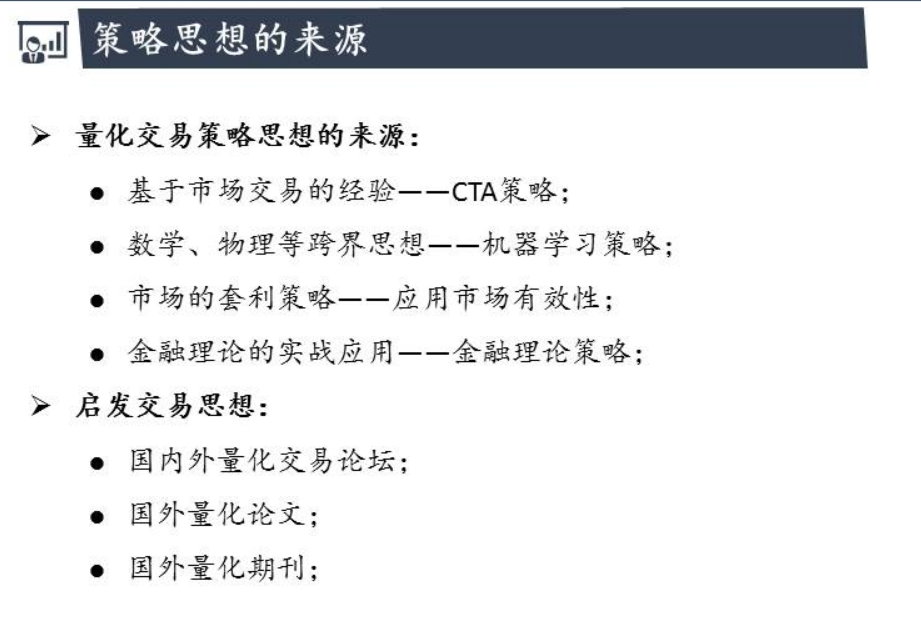

# 策略思想来源

## 1.市场交易经验(最常见)

- 有经验的操盘手、交易员
- 举例：一个策略是与波动率有关的
  - 股票价格一直涨
  - volatility 就很低
  - 此时要注意 : 波动率往往低的时候蕴含危机
  - 大多数情况 的危机来临之前波动率很低
- 启发: 如果波动率在多少天都维持较低水平,这时可以开空仓 或者平多仓

## 2.机器学习

- 数学物理的思想

## 3.市场套利策略

- 相同东西的不同价格
- 统计套利 : 风险稍大
- 无风险套利 :几乎没风险
- 市场完全有效的话没有套利机会 
- 但市场一般不是那么有效的

## 4.金融理论

- CAPM
- EF
- BL

