# 量化择时

**什么时候买 , 什么时候卖**

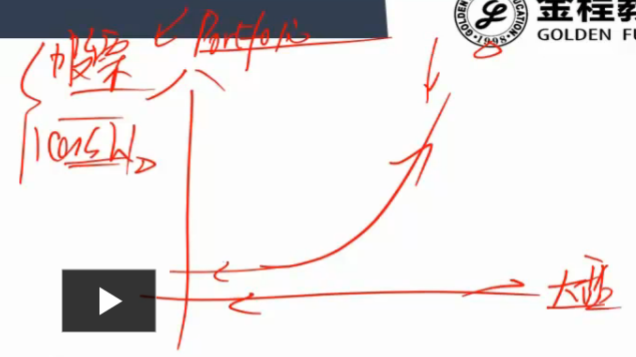

- 收益曲线 : 一种抛物线的形状
- 大盘涨, 我比大盘涨得好 ; 大盘跌 , 比大盘跌得少

## 1.因果系统

- 要能说出个所以然
- 为什么现在买
- 为什么现在卖

## 2.封闭系统(至少短期)

- 择时策略在大系统是封闭的时候更有效一些
- 反转策略

## 3.择时维度

1. 宏观经济指标 
2. 公司基本面
3. 市场技术指标
4. 投资者情绪

# 几个重要策略

## 1.均线模型

- 高频均线策略一定要考虑买卖成本
- 短穿长 : 说明近5天大家比较看好这支股票  买的成本大于过去20天的平均成本
- 胜率低赔率高
- 能抓住大趋势

### 1.1优化思路:

- 信号过滤
  - 一个策略会产生非常多的信号
  - 但不是每个信号都执行
  - 交易太频繁, 成本会很大
  - 过滤后才是有效信号
- 设定SD点位 : 上穿一定点位才买

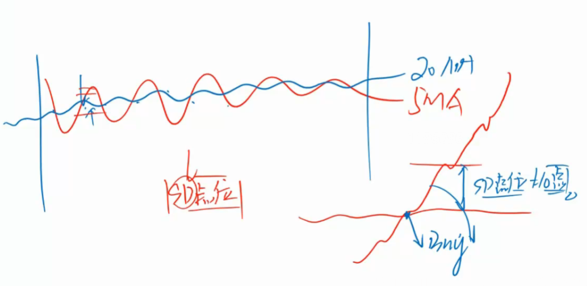

- 牛市 价格在250日均线上方

  - 大趋势还是在下降
  - 跟趋势走 , 做趋势追踪

  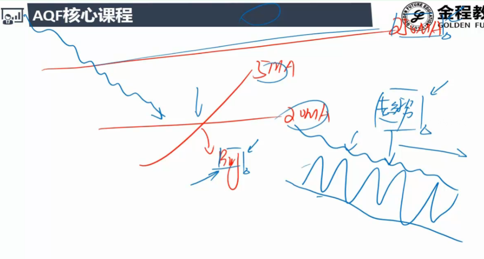

- 必须今天的移动平均大于昨天的

  - 也就是股票必须是涨的

  - 被动金叉

  - 现在也不看好 , 只是比过去稍微好一点

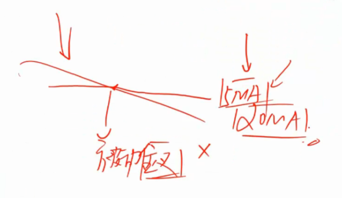

​    

### 1.2实例

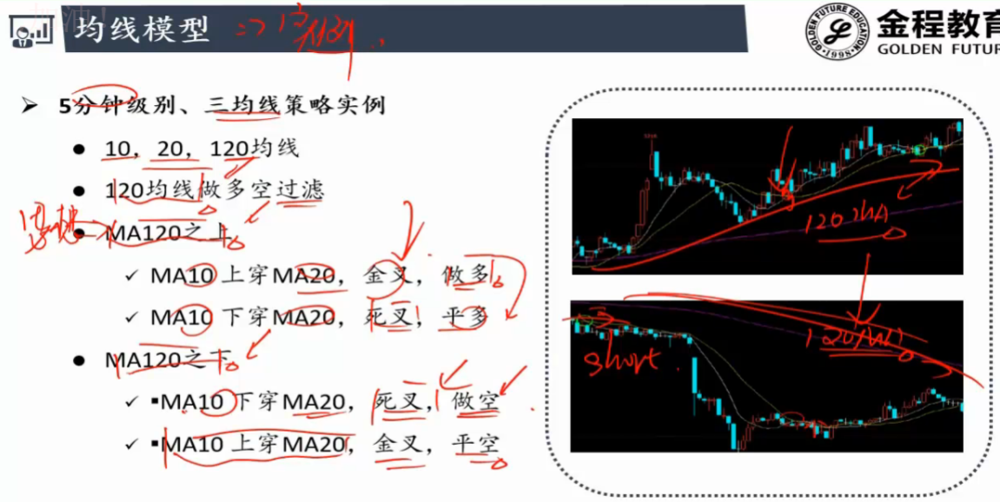

## 2.KDJ指标

- 随机指标
- 三条线 ：K 线 D 线 J 线
- J 线敏感性好，反应速度快
- 短期择时
- 胜率高赔率低

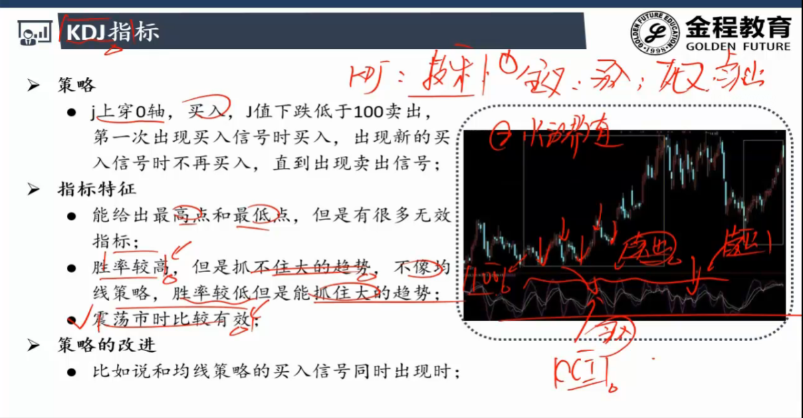

## 3.技术指标背离

**MACD(指数平滑移动平均) :**

- 两条线 :快线和慢线

- 金叉死叉如果发生在0轴附近效果就不太好
- 发生在0轴较远的地方好
  - 高位死叉 ; 低位金叉

- 红柱越大 : 多头市场力量越强
- 绿柱越大:  卖方越强

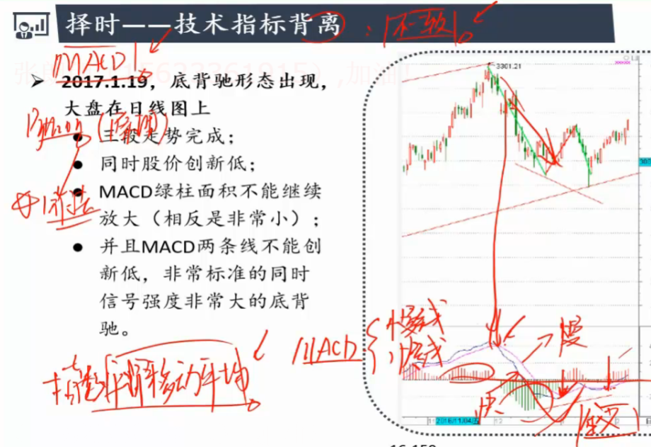

**背离 ： 股票价格走势和技术指标走势不一致**

- 发生背离后， 要么股价要么技术指标会有一个收复的补助动作

### **3.1底背离**

- 股价新低 , 但MACD 没有新低反而平稳上涨
- 预示着接下来股价大概率上涨

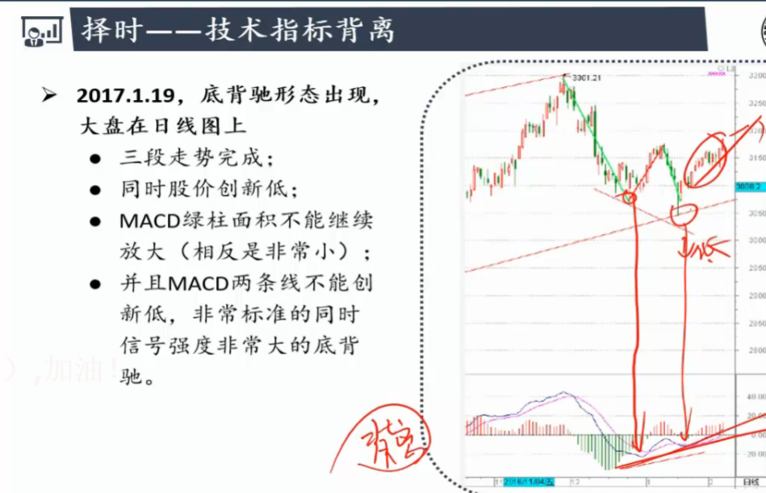

- 观察红绿柱

  - 股价新低但是绿柱无法放大
  - 空方力量不足
  - 大概率反弹

  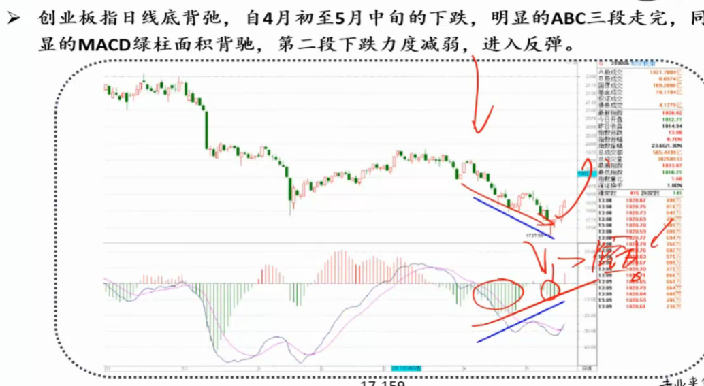

## 4.HANS123策略

- 期货上运用较多 :日内策略
- 最高价 :压力线
- 最低价: 支撑线

### 4.1背后思想

- 刚开盘的时候交易量最活跃
- 经过一晚的信息调整
- 多空双方对今天走势的分析最激烈
- 突破上下轨有一种大势所驱的感觉

### 4.2优化改进

- 盈利回吐

  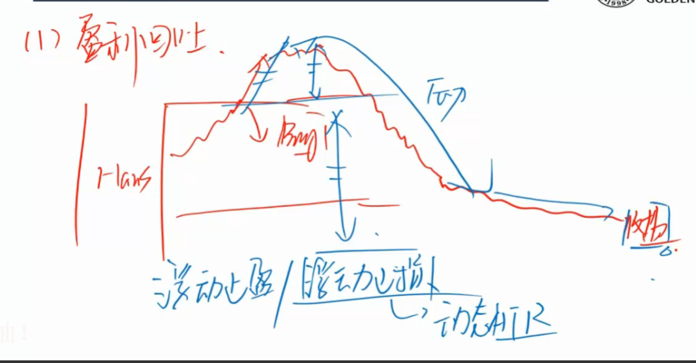

  - 浮动止盈/止损(动态ATR)
  - 止盈价格水涨船高

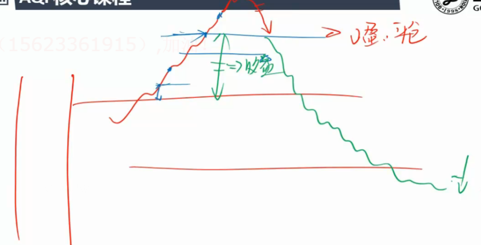

- 止盈错过大行情

  - 二次开仓

  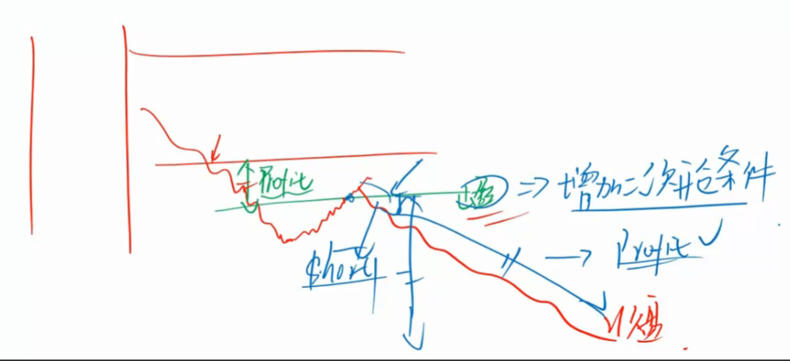

## 5.多项式回归

**业绩归因**:

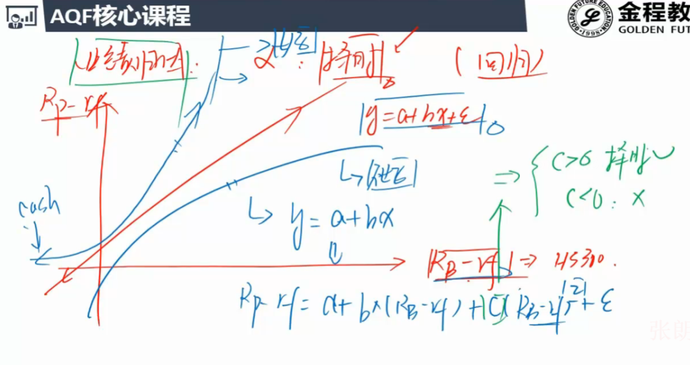

- 基金经理业绩收益跟基准收益的二次项回归
- c 显著> 0 明显跑赢大盘
- c 显著<0  明显跑输大盘

**股票价格和时间进行回归**

一次项回归:

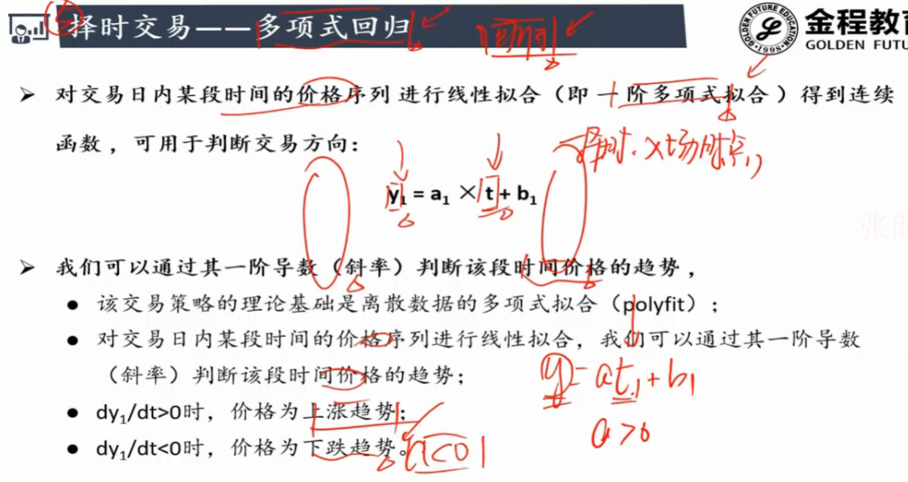

二次项回归:

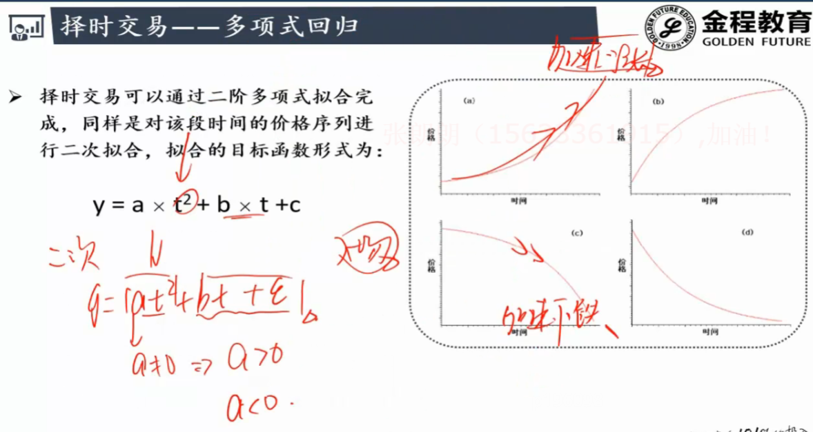