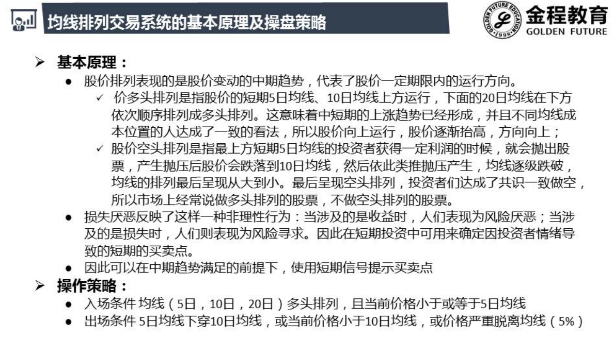
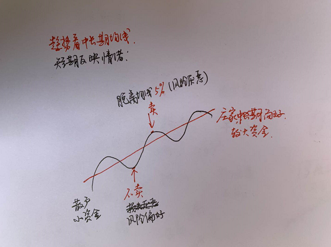

# 择时

- 当前价格小于10日均线 , 止损卖出
- 中期均线 : 庄家行为 , 大资金维持 
  - 目的性
- 短期均线 : 散户 , 小资金
  - 非目的性 , 形不成趋势
  - 损失厌恶

## 损失厌恶

- 截断利润 , 让损失飞
- 利用这种心理开发策略

# 选股

- 选择PE最大的100支
- 因为是看长做短 , 散户对短期的影响比较大
- 散户又喜欢小盘股 , 创业板都是小盘股 , 估值高 ,PE大