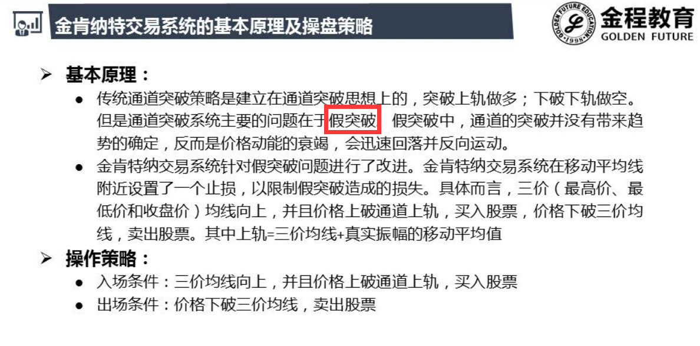
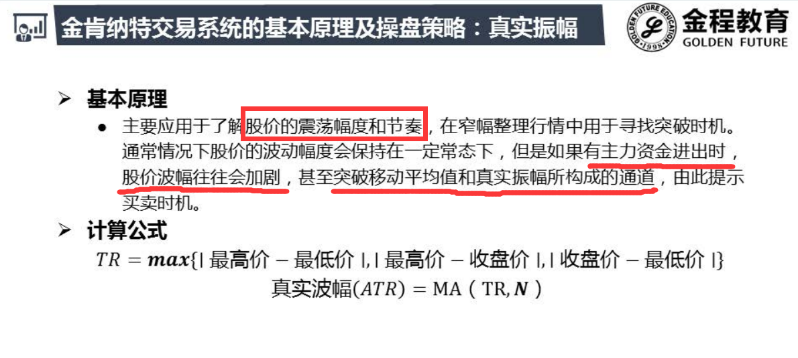

| 交易系统 | 均线排列         | 金肯纳特          |
| -------- | ---------------- | ----------------- |
| 目标     | 上涨             | 买方强势          |
| 多角度   | 中期、短期       | 突破、确认        |
| 指标     | 多头排列、支撑位 | ATR、三价均线向上 |

# 原理

- 买方力道
  - 突破阻力 ---- 通道上轨
- 确认
  - 三价均线向上 ：（H,L,C)/3
  - 可用WVAD替换

## ATR

- 突破了前期振幅的最大平均值 ，表示买方力量突然变大

