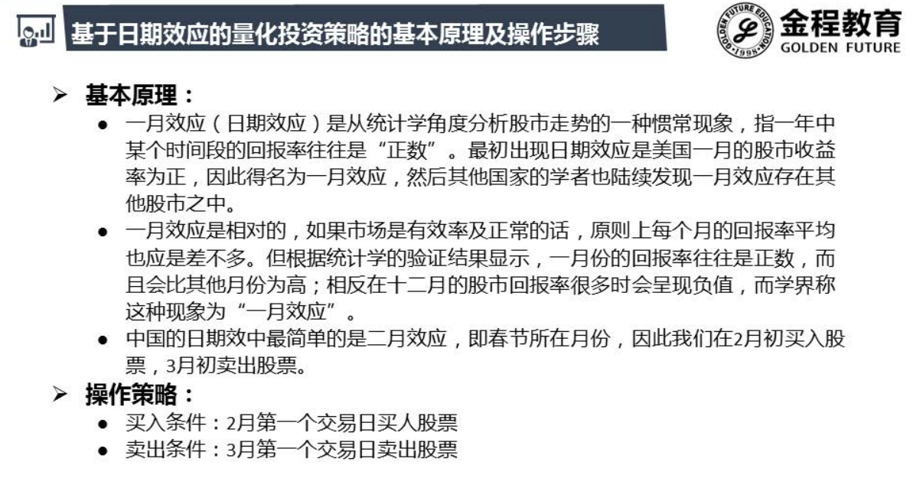
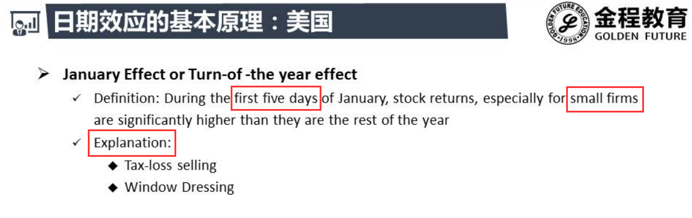

# 日期效应

- 两会 , 五一 ,十一 , 七月国产电影保护月(战狼2)
- 策略期限短 , 不会占用资金 ,可与其他表现好的策略叠加

- 二月第一个交易日买**中小板**的股票

## 一月效应(美国)

### 解释

- 为了避税 , 在年前十二月卖出 , 然后再在年后一月买入
- 为了年末年检保持4:6 卖出股票买债券
- 小盘股成交量小, 影响大 ; 大盘股成交量大 ,影响小