# 前导

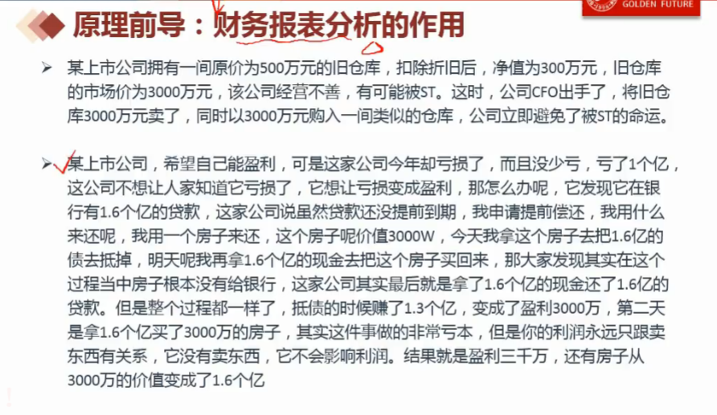

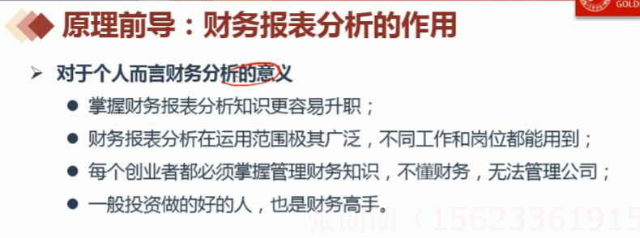

# 局限性

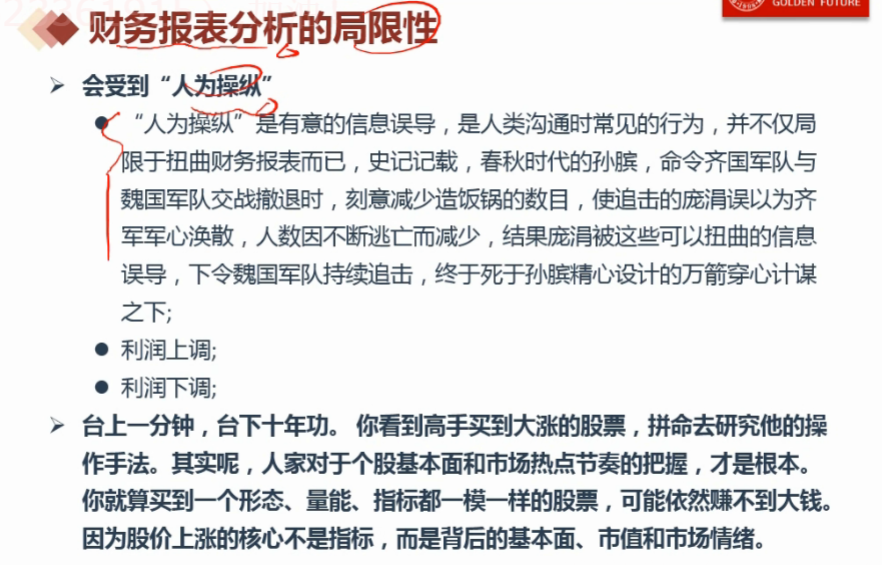

# 四大支柱

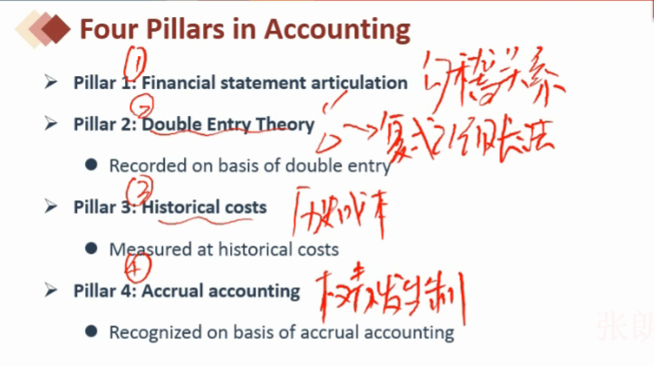

## 勾稽关系

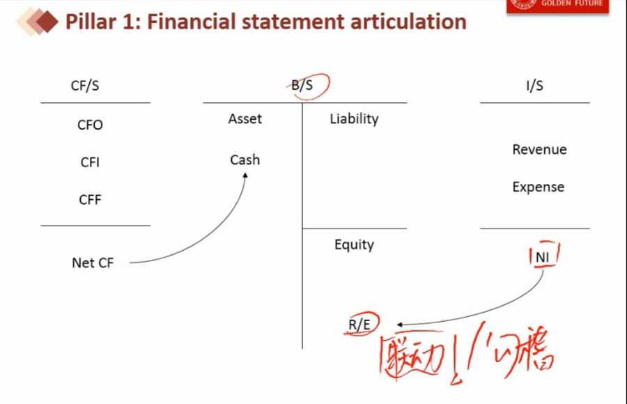

## 复式记账法

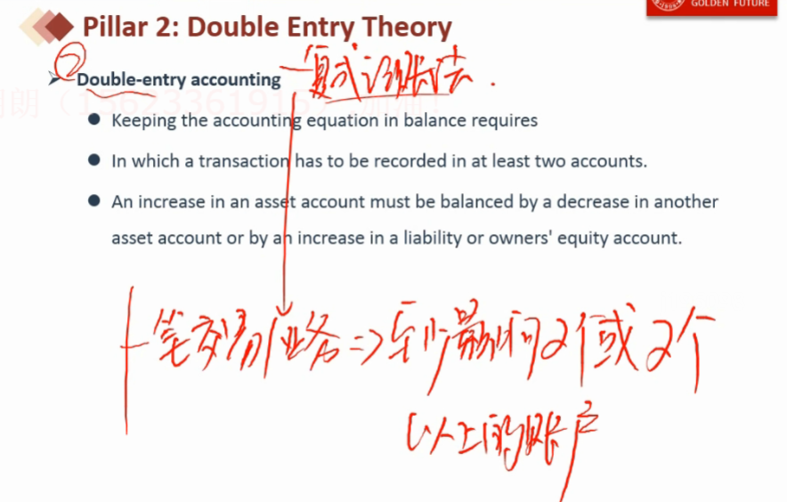

## 权责发生制

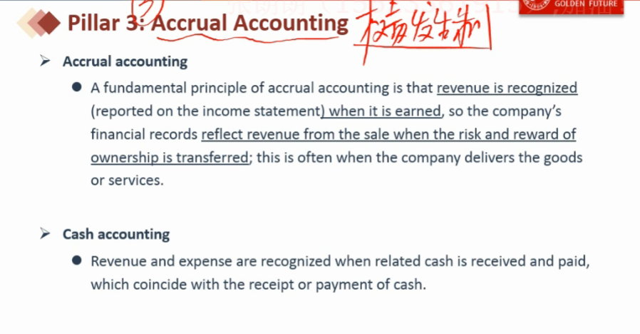

- 确认收入两个条件:
  - 权利和义务已经发生转移
  - 收回款项可以确定

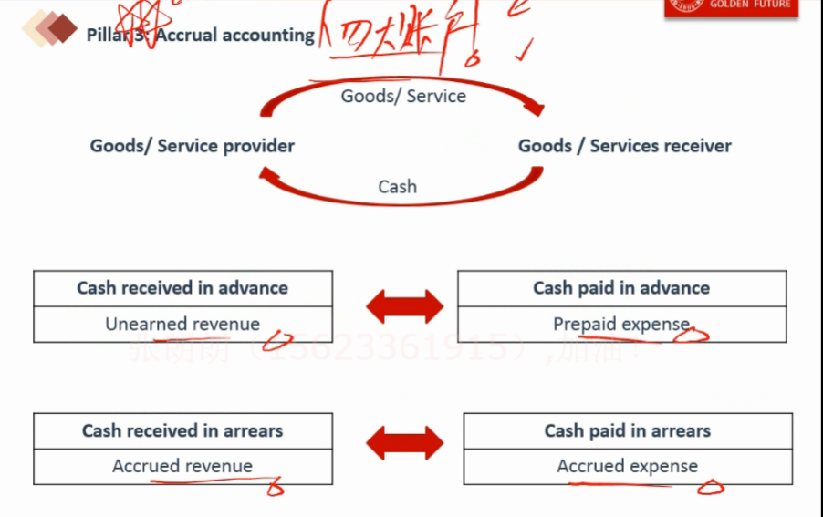

### 应收账款

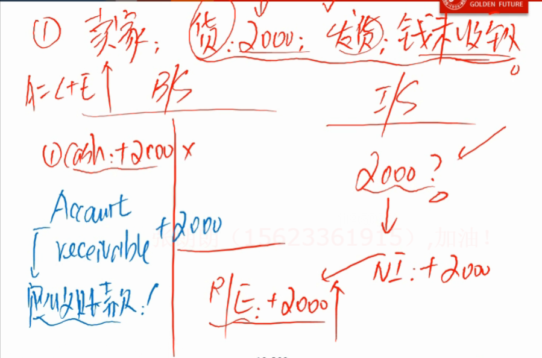

### 预收账款

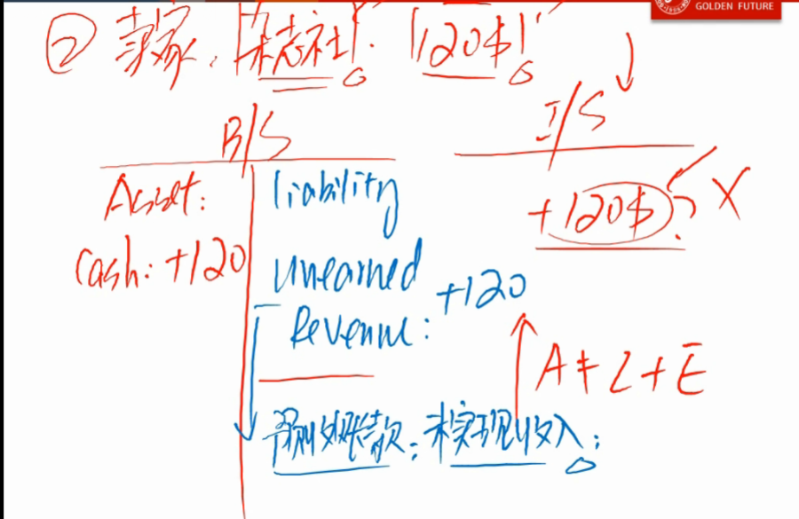

### 预付账款

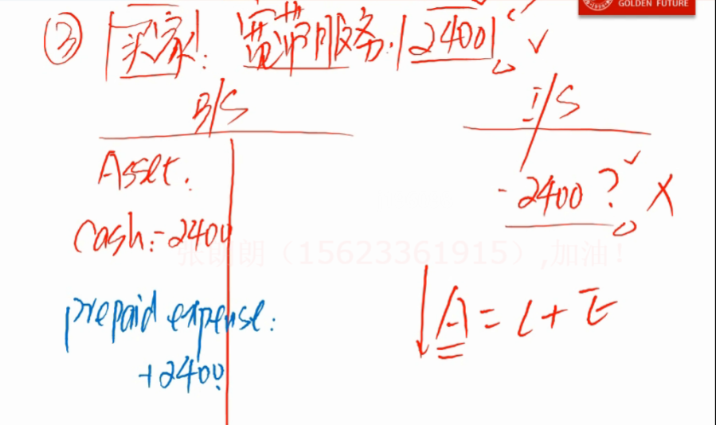

### 应付账款

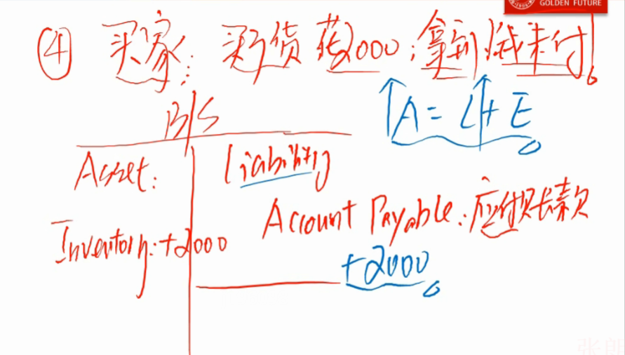

# 三大报表

## 资产负债表

- B/S : Balance statement

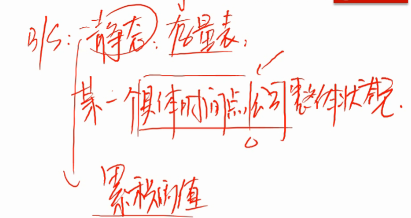

## 利润表

- I/S : Income statement
- 利润表是对资产负债表上的留存收益的补充说明

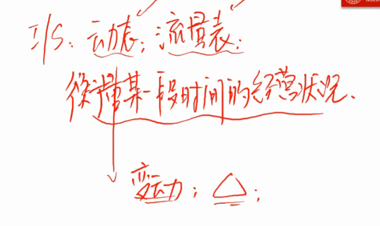

## 现金流量表

- CF/S : Cash Flow statement
- 现金流量表是对资产负债表上的现金的补充说明